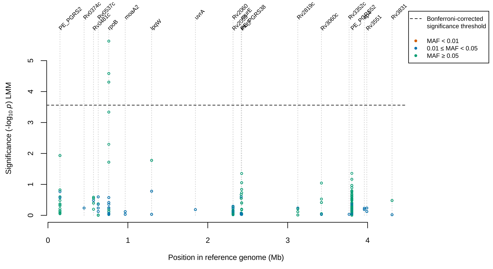
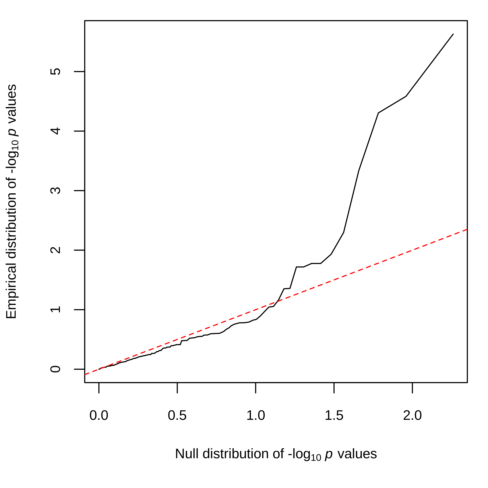
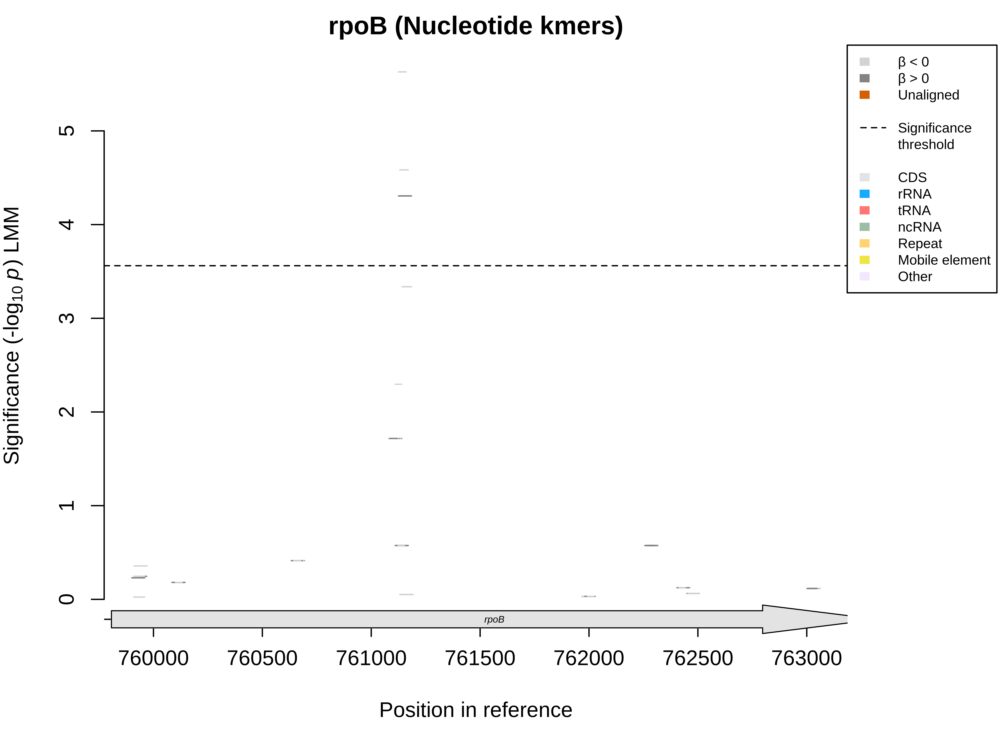
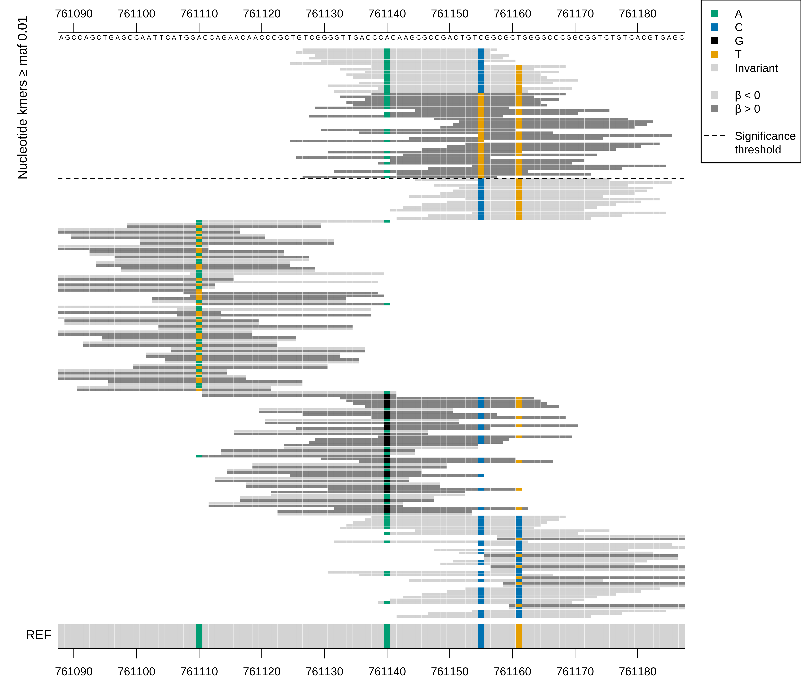

# Kmer pipeline

Pipeline for performing nucleotide and protein kmer GWAS analyses using Nextflow.

Sarah G Earle and Daniel J Wilson, University of Oxford Big Data Institute. Version 2026-10-06.

This version ports the workflow scripts from R to Python, so that errors report the file and line
where they occurred; the figures are still drawn in R.

Implementing methods described in

**Genome-wide association studies of global *Mycobacterium tuberculosis* resistance to thirteen
antimicrobials in 10,228 genomes.** The CRyPTIC Consortium (2022) *PLOS Biology*
[20: e3001755](https://journals.plos.org/plosbiology/article?id=10.1371/journal.pbio.3001755).

**Identifying lineage effects when controlling for population structure improves power in
bacterial association studies.** Earle, S. G., Wu, C.-H., Charlesworth, J., Stoesser, N., Gordon,
N. C., Walker, T. M., Spencer, C. C. A., Iqbal, Z., Clifton, D. A., Hopkins, K. L., Woodford, N.,
Smith, E. G., Ismail, N., Llewelyn, M. J., Peto, T. E., Crook, D. W., McVean, G., Walker, A. S.
and D. J. Wilson (2016) *Nature Microbiology* 1: 16041
([preprint](http://arxiv.org/abs/1510.06863)).

**Input**

| Input | Description |
|---|---|
| Phenotypes | Binary or continuous phenotypes. If any phenotypes are NA, the samples with NA phenotypes will be ignored in the LMM and when determining the minor allele counts/frequencies but will be included in the other pattern files. |
| Genotypes | Kmer counting input is assembly contigs (FASTA, optionally gzipped); the pipeline does not assemble reads. Junk contigs, such as adapter dimers, poly-A runs and other very short contigs, produce k-mers that can reach the association test and top the Manhattan plot, so set `min_contig_length` (default 0, which keeps every contig; a value of 10 times the k-mer length, in bases, is a sensible start) to ignore short contigs, and trim adapters from reads before assembly. K-mers that are at least 90% one base or residue are marked with a * in the report tables (they are kept in the analysis). Kmers are counted as present if seen once in a genome. |

**License**

The zstr headers are licensed under the MIT license. The myutils headers are licensed under the
GNU Lesser General Public License Version 3. All other code is licensed under the GNU General
Public License v3.0.

## Contents

- [Installation](#installation)
- [Example commands: Singularity](#example-commands-singularity)
- [Example commands: Docker](#example-commands-docker)
- [Example output: Candidate gene analysis of rifampicin resistance in *M. tuberculosis*](#example-output-candidate-gene-analysis-of-rifampicin-resistance-in-m-tuberculosis)
- [Running Nextflow](#running-nextflow)
- [nextflow.config file](#nextflowconfig-file)
- [Step 1 Count kmers](#step-1-count-kmers)
- [Step 2 Create unique kmer list](#step-2-create-unique-kmer-list)
- [Step 3 Create kmer presence/absence patterns and kinship matrix](#step-3-create-kmer-presenceabsence-patterns-and-kinship-matrix)
- [Step 4 Run GEMMA](#step-4-run-gemma)
- [Step 5 Run contig alignment](#step-5-run-contig-alignment)
- [Step 5A Merge kmer/gene alignments](#step-5a-merge-kmergene-alignments)
- [Step 6 Plot figures using contig alignment positions](#step-6-plot-figures-using-contig-alignment-positions)
- [Step 5B Run bowtie2 (nucleotide kmers only)](#step-5b-run-bowtie2-nucleotide-kmers-only)
- [Step 6B Plot figures using bowtie2 mapping positions (nucleotide kmers only)](#step-6b-plot-figures-using-bowtie2-mapping-positions-nucleotide-kmers-only)
- [Step 7A Generate a kmer GWAS report](#step-7a-generate-a-kmer-gwas-report)
- [Step 7B Generate a kmer GWAS report for a specific gene](#step-7b-generate-a-kmer-gwas-report-for-a-specific-gene)
- [Step 7C Generate a kmer GWAS report for unmapped kmers](#step-7c-generate-a-kmer-gwas-report-for-unmapped-kmers)
- [Get kmer presence counts](#get-kmer-presence-counts)
- [Dependencies](#dependencies)
- [Full list of pipeline scripts](#full-list-of-pipeline-scripts)

## Installation

| Output |
|---|
| Docker image `dannywilson/kmer_pipeline:2026-10-06` or Singularity image `kmer_pipeline_2026-10-06.sif`, and the Nextflow pipeline `kmer_pipeline.nf`. |


**Platform:** the image is built for x86-64 (amd64) Linux, as used by most servers, clusters and
Intel Macs. On a Mac with Apple Silicon (arm64), Docker runs it under emulation, which works but
is slower. Before any of the Docker commands below, type

```sh
export DOCKER_DEFAULT_PLATFORM=linux/amd64
```

in the same terminal. Otherwise Docker warns about the platform on every run, and the pipeline
stops at its first step, which requires a step to print nothing on the error stream.
Singularity (or its successor Apptainer, which provides the same `singularity` command) needs an
x86-64 Linux machine.

The examples edit files with `sed -i.bak`, which works with both the Linux and the macOS
versions of `sed` and keeps a copy of each original file ending `.bak`.

**1. Singularity container: pull from DockerHub (*recommended*)**

---

**Prerequisites**: Singularity installation, up to 10 GiB storage, 1 CPU.

Open a terminal session where Singularity is available, e.g. via ssh.

Build a Singularity image by pulling the DockerHub image.

```sh install-singularity
singularity pull -F docker://dannywilson/kmer_pipeline:2026-10-06
```

Copy the Nextflow pipeline to a local file

```sh install-singularity
singularity exec --containall --cleanenv kmer_pipeline_2026-10-06.sif cat \
    /usr/local/bin/kmer_pipeline.nf > ./kmer_pipeline.nf
```

**2. Docker container: pull from DockerHub (*recommended*)**

---

**Prerequisites**: Docker installation, up to 10 GiB storage, 1 CPU.

Open a terminal session where Docker is available, e.g. via ssh.

Pull the Docker image from DockerHub

```sh install-docker
docker pull dannywilson/kmer_pipeline:2026-10-06
```

Copy the Nextflow pipeline to a local file

```sh install-docker
docker run --rm dannywilson/kmer_pipeline:2026-10-06 cat /usr/local/bin/kmer_pipeline.nf > \
    ./kmer_pipeline.nf
```

**3. Docker container: manual build (*not recommended*)**

---

**Prerequisites**: Docker and Git installations, up to 10 GiB storage, 1 CPU.

Open a terminal session where Docker and Git are available, e.g. via ssh.

Create a local directory and clone a specific release of the repository

```sh install-build
git clone --depth 1 --branch 2026-10-06 https://github.com/danny-wilson/kmer_pipeline.git
```

Build the Docker image from the Dockerfile. The
Dockerfile adds this release's scripts to the image of release 2022-10-26, which provides R, the
external tools and the compiled C++ tools.

```sh install-build
cd kmer_pipeline
docker build -t dannywilson/kmer_pipeline:2026-10-06 .
```

Copy the Nextflow pipeline to a local file

```sh install-build
docker run --rm dannywilson/kmer_pipeline:2026-10-06 cat /usr/local/bin/kmer_pipeline.nf > \
    ./kmer_pipeline.nf
```

## Example commands: Singularity

| Output |
|---|
| Executes the kmer pipeline end-to-end, producing one file ending `.report.html` and one directory ending `_kmergenealign_figures`. Together they contain a summary of the GWAS results readable in a web browser, including Manhattan plots, QQ plots, tables of significant regions and kmers. |


See the previous section for installation of the Singularity container.

**1. Nextflow inside Singularity (*quick start*)**

---

**Prerequisites**: Singularity, kmer_pipeline Singularity container

*If you have Nextflow installed, it is recommended to start with Nextflow outside Singularity
(next example). That makes it simpler to understand the configuration files, in which file paths
are specified relative to the user file system, rather than the container file system as here.*

Begin by defining the location, on the user file system, of the Singularity container. E.g.

```sh singularity-inside
CONTAINER=/users/username/kmer_pipeline/kmer_pipeline_2026-10-06.sif
```

*Replace the above with the full path and filename of the Singularity container on your system.*

Next locate the mountpoint: the directory to share with the container that allows it read/write
access. This directory must contain, directly or through its subdirectories, all the input
files, and the location for the output files in your analysis. E.g.

```sh singularity-inside
MNT_DIR=/users/username/kmer_pipeline
```

*Replace the above with the full path of the desired mountpoint on your system.*

Within the container, `MNT_DIR` will be visible as `/home/jovyan`. Within `MNT_DIR` create a
subdirectory called `tb20` to act as the base directory for the example analysis; this is the
`base_dir` that is specified in the example `nextflow.config`.

```sh singularity-inside
BASE_DIR=$MNT_DIR/tb20
mkdir -p $BASE_DIR
```

Open an interactive bash shell within the container.

```sh singularity-inside
singularity exec --containall --cleanenv --home $MNT_DIR:/home/jovyan $CONTAINER bash
```

Now within the container, copy the example configuration file to the base directory, renaming it
`nextflow.config`

```sh singularity-inside:container
cp /usr/share/kmer_pipeline/example/baremetal.nextflow.config ~/tb20/nextflow.config
```

Navigate to the base directory and launch the analysis; Nextflow automatically reads the
`nextflow.config` file in the current directory.

```sh singularity-inside:container
cd tb20 && kmer_pipeline.nf
```

In testing, this took about 6 minutes with two CPUs. When the analysis
is done, type `exit` to close the interactive container. The output files will be in `$BASE_DIR`
on the user file system.

To view the results, use a web browser to open the `*.report.html` file in `$BASE_DIR/kmergwas`
(i.e. the location on the user file system implied by `analysis_dir` in `nextflow.config`). If
downloading the results from a remote server, make sure to download all files matching
`*report*` in `$BASE_DIR/kmergwas` plus the subdirectory `*_kmergenealign_figures`.

***Adapting this example for your data:*** In this example, the entire analysis is run *within*
the container. Output files are mutually visible because `$MNT_DIR` on the user file system is
*mounted* to `/home/jovyan` on the container file system. For your own analysis, you need to:

- Modify `nextflow.config` as required, for example varying file locations and setting `maxp` to
  the number of CPUs available. Make sure `nextflow.config` is situated in the base directory,
  from which you will launch Nextflow.
- Modify the `id_file` specified in `nextflow.config` to contain your own sample IDs, genome
  assembly paths, and phenotypes.
- **NB: when running kmer_pipeline *inside* a container,** file locations in `nextflow.config`,
  and the `paths` column in `id_file` must all contain the full absolute paths for the location
  of genome assemblies on the *container file system* because **the container cannot directly
  see the user file system**. For example, if the assembly
  `/usr/username/kmer_pipeline/contigs/assembly1.fa.gz` is the full absolute path on the *user
  file system*, and if `MNT_DIR=/usr/username/kmer_pipeline` then the full absolute path on the
  *container file system* will be `/home/jovyan/contigs/assembly1.fa.gz`. Likewise, if
  `nextflow.config` specifies `base_dir = "/home/jovyan/tb20"`, that implies the base directory
  on the user file system will be `$MNT_DIR/tb20`.

**2. Nextflow outside Singularity (*recommended on bare metal machines*)**

---

**Prerequisites**: Nextflow, Singularity, kmer_pipeline Singularity container

*In this approach, Singularity is called by Nextflow, and the contents of `nextflow.config` and
`id_file` refer to files in the user file system, which is simpler. However, Nextflow must now be
installed on the user machine. This approach is limited by the number of CPUs and the amount of
RAM available on the user machine. For larger scale analysis, Nextflow on a cluster (next
example) is recommended.*

Begin by defining the location, on the user file system, of the Singularity container. E.g.

```sh singularity-host
CONTAINER=/users/username/kmer_pipeline/kmer_pipeline_2026-10-06.sif
```

*Replace the above with the full path and filename of the Singularity container on your system.*

Next locate the base directory for the analysis. Nextflow will automatically make this the
mountpoint: the directory to share with the container that allows it read/write access. This
directory must contain, directly or through its subdirectories, all the input files, and the
location for the output files in your analysis. E.g.

```sh singularity-host
BASE_DIR=/users/username/kmer_pipeline
```

*Replace the above with the full path of the desired base directory/mountpoint on your system.*

If it does not already exist, create the base directory and a subdirectory called `tb20` to
contain the example data.

```sh singularity-host
mkdir -p $BASE_DIR/tb20
```

Next extract the example files to `$BASE_DIR/tb20` in the user file system.

```sh singularity-host
cd $BASE_DIR/tb20 && singularity exec --containall --cleanenv $CONTAINER bash -c \
    'cd /usr/share/kmer_pipeline/example && tar -c .' | tar -x
```

Now edit the example configuration file to point to the correct locations on the user file
system. First edit the location of the container path:

```sh singularity-host
sed "s,YOUR_CONTAINER_PATH_HERE/kmer_pipeline_2026-10-06.sif,$CONTAINER,g" \
    singularity.nextflow.config > $BASE_DIR/nextflow.config
```

Next substitute the correct base directory in the configuration file:

```sh singularity-host
sed -i.bak "s,YOUR_PATH_HERE,$BASE_DIR,g" $BASE_DIR/nextflow.config
```

The `id_file` must also be updated to give the location of the example genome assemblies on the
user file system:

```sh singularity-host
sed -i.bak "s,/usr/share/kmer_pipeline/example/,$BASE_DIR/tb20/,g" $BASE_DIR/tb20/id_file.txt
```

Extract the kmer_pipeline Nextflow script to the base directory:

```sh singularity-host
singularity exec --containall --cleanenv $CONTAINER cat /usr/local/bin/kmer_pipeline.nf > \
    $BASE_DIR/kmer_pipeline.nf
```

Navigate to the base directory and launch the analysis; Nextflow automatically reads the
`nextflow.config` file in the current directory.

```sh singularity-host
cd $BASE_DIR && nextflow kmer_pipeline.nf
```

In testing, this took about 9 minutes with two CPUs. The output files
will be in `$BASE_DIR` on the user file system.

To view the results, use a web browser to open the `*.report.html` file in
`$BASE_DIR/tb20/kmergwas` (i.e. the location on the user file system specified by
`analysis_dir` in `nextflow.config`). If downloading the results from a remote server, make sure
to download all files matching `*report*` in `$BASE_DIR/tb20/kmergwas` plus the subdirectory
`*_kmergenealign_figures`.

***Adapting this example for your data:*** In this example, the user interacts with Nextflow
directly, which handles calls to the container. The locations of input and output files are
clear because in `nextflow.config` and `id_file` they are specified in full absolute paths on the
*user file system*. For your own analysis, you need to:

- Modify `nextflow.config` as required, for example varying file locations and setting `maxp` to
  the number of CPUs available. Make sure `nextflow.config` is situated in the base directory,
  from which you will launch Nextflow.
- Modify the `id_file` specified in `nextflow.config` to contain your own sample IDs, genome
  assembly paths, and phenotypes.

Refer to [nextflow.config file](#nextflowconfig-file) for an explanation of all parameters in
`nextflow.config`.

**3. Nextflow on a cluster using Singularity (*recommended at scale*)**

---

**Prerequisites**: Cluster environment supported by Nextflow (e.g. Sun Grid Engine, SLURM),
Nextflow, Singularity, kmer_pipeline Singularity container

*This approach is recommended for analysis at scale (e.g. hundreds or more genomes). However, for
troubleshooting, the simpler approach of the previous example is suggested (Nextflow outside
Singularity), starting with ensuring that the example analysis can be run. Like in the previous
example, all file names are specified with full absolute paths on the user file system.*

Begin by defining the location, on the user file system, of the Singularity container. E.g.

```sh singularity-cluster
CONTAINER=/users/username/kmer_pipeline/kmer_pipeline_2026-10-06.sif
```

*Replace the above with the full path and filename of the Singularity container on your system.*

Next locate the base directory for the analysis. Nextflow will automatically make this the
mountpoint: the directory to share with the container that allows it read/write access. This
directory must contain, directly or through its subdirectories, all the input files, and the
location for the output files in your analysis. E.g.

```sh singularity-cluster
BASE_DIR=/users/username/kmer_pipeline
```

*Replace the above with the full path of the desired base directory/mountpoint on your system.*

If it does not already exist, create the base directory and a subdirectory called `tb20` to
contain the example data.

```sh singularity-cluster
mkdir -p $BASE_DIR/tb20
```

Next extract the example files to `$BASE_DIR/tb20` in the user file system.

```sh singularity-cluster
cd $BASE_DIR/tb20 && singularity exec --containall --cleanenv $CONTAINER bash -c \
    'cd /usr/share/kmer_pipeline/example && tar -c .' | tar -x
```

Now edit the example configuration file to point to the correct locations on the user file
system. First edit the location of the container path:

```sh singularity-cluster
sed "s,YOUR_CONTAINER_PATH_HERE/kmer_pipeline_2026-10-06.sif,$CONTAINER,g" sge.nextflow.config \
    > $BASE_DIR/nextflow.config
```

Next substitute the correct base directory in the configuration file:

```sh singularity-cluster
sed -i.bak "s,YOUR_PATH_HERE,$BASE_DIR,g" $BASE_DIR/nextflow.config
```

Note the addition of a `process` section in `nextflow.config` which was absent from the previous
example; this is the only difference in configuration between the two examples. The `process`
section contains two parameters, `executor` and `queue`. **These must be customized for your
system, *particularly the queue name*.** Specify the type of cluster, e.g. "sge" or "slurm" and
the queue (or partition) name; refer to the
[Nextflow documentation](https://www.nextflow.io/docs/latest/executor.html) for further details.

```sh singularity-cluster
EXECUTOR="sge"
QUEUE="short.qc"
```

Another difference compared to the previous example is that `maxp` is set to `30`, the number of
genomes. If you have more than 30 CPUs available, you could increase `maxp`, although the gain on
the example data is likely to be marginal. Note that not all steps in kmer_pipeline can utilize
all available CPUs. For example, the degree of parallelization in some steps is determined by the
number of genomes.

Now substitute your customized values into `nextflow.config`:

```sh singularity-cluster
sed -i.bak "s,sge,$EXECUTOR,g" $BASE_DIR/nextflow.config
sed -i.bak "s,short.qc,$QUEUE,g" $BASE_DIR/nextflow.config
```

The `id_file` must also be updated to give the location of the example genome assemblies on the
user file system:

```sh singularity-cluster
sed -i.bak "s,/usr/share/kmer_pipeline/example/,$BASE_DIR/tb20/,g" $BASE_DIR/tb20/id_file.txt
```

Extract the kmer_pipeline Nextflow script to the base directory:

```sh singularity-cluster
singularity exec --containall --cleanenv $CONTAINER cat /usr/local/bin/kmer_pipeline.nf > \
    $BASE_DIR/kmer_pipeline.nf
```

Navigate to the base directory and launch the analysis; Nextflow automatically reads the
`nextflow.config` file in the current directory.

```sh singularity-cluster
cd $BASE_DIR && nextflow kmer_pipeline.nf
```

In testing, this took about 8 minutes with 30 CPUs, but the run time
can be strongly influenced by time spent queuing on the cluster. The output files will be in
`$BASE_DIR` on the user file system.

To view the results, use a web browser to open the `*.report.html` file in
`$BASE_DIR/tb20/kmergwas` (i.e. the location on the user file system specified by
`analysis_dir` in `nextflow.config`). If downloading the results from a remote server, make sure
to download all files matching `*report*` in `$BASE_DIR/tb20/kmergwas` plus the subdirectory
`*_kmergenealign_figures`.

***Adapting this example for your data:*** In this example, the user interacts with Nextflow
directly, which handles calls to the container via the cluster management software. The
locations of input and output files are clear because in `nextflow.config` and `id_file` they are
specified in full absolute paths on the *user file system*. For your own analysis, you need to:

- Modify `nextflow.config` as required, for example varying file locations, setting `maxp` to the
  number of CPUs available, and ensuring the `queue` name is set correctly. Make sure
  `nextflow.config` is situated in the base directory, from which you will launch Nextflow.
- Modify the `id_file` specified in `nextflow.config` to contain your own sample IDs, genome
  assembly paths, and phenotypes.

Refer to [nextflow.config file](#nextflowconfig-file) for an explanation of all parameters in
`nextflow.config`.

## Example commands: Docker

| Output |
|---|
| Executes the kmer pipeline end-to-end, producing one file ending `.report.html` and one directory ending `_kmergenealign_figures`. Together they contain a summary of the GWAS results readable in a web browser, including Manhattan plots, QQ plots, tables of significant regions and kmers. |


See the earlier section for installation of the Docker container.

**1. Nextflow inside Docker (*quick start*)**

---

**Prerequisites**: Docker, kmer_pipeline Docker image

*If you have Nextflow installed, it is recommended to start with Nextflow outside Docker (next
example). That makes it simpler to understand the configuration files, in which file paths are
specified relative to the user file system, rather than the container file system as here.*

Begin by defining the name of the Docker image downloaded earlier. E.g.

```sh docker-inside
CONTAINER="dannywilson/kmer_pipeline:2026-10-06"
```

*Replace the above with the name of the Docker image on your system, if different.*

Next locate the mountpoint: the directory to share with the container that allows it read/write
access. This directory must contain, directly or through its subdirectories, all the input
files, and the location for the output files in your analysis. E.g.

```sh docker-inside
MNT_DIR=/users/username/kmer_pipeline
```

*Replace the above with the full path of the desired mountpoint on your system.*

Within the container, `MNT_DIR` will be visible as `/home/jovyan`. Within `MNT_DIR` create a
subdirectory called `tb20` to act as the base directory for the example analysis; this is the
`base_dir` that is specified in the example `nextflow.config`.

```sh docker-inside
BASE_DIR=$MNT_DIR/tb20
mkdir -p $BASE_DIR
```

Open an interactive bash shell within the container.

```sh docker-inside
docker run -it --rm -v $MNT_DIR:/home/jovyan $CONTAINER bash
```

Now within the container, copy the example configuration file to the base directory, renaming it
`nextflow.config`

```sh docker-inside:container
cp /usr/share/kmer_pipeline/example/baremetal.nextflow.config ~/tb20/nextflow.config
```

Navigate to the base directory and launch the analysis; Nextflow automatically reads the
`nextflow.config` file in the current directory.

```sh docker-inside:container
cd tb20 && kmer_pipeline.nf
```

In testing, this took about 7 minutes with two CPUs (on an Apple Silicon Mac, under
emulation). When the analysis is done, type `exit` to close the interactive container. The output files will be in `$BASE_DIR`
on the user file system.

To view the results, use a web browser to open the `*.report.html` file in `$BASE_DIR/kmergwas`
(i.e. the location on the user file system implied by `analysis_dir` in `nextflow.config`). If
downloading the results from a remote server, make sure to download all files matching
`*report*` in `$BASE_DIR/kmergwas` plus the subdirectory `*_kmergenealign_figures`.

***Adapting this example for your data:*** In this example, the entire analysis is run *within*
the container. Output files are mutually visible because `$MNT_DIR` on the user file system is
*mounted* to `/home/jovyan` on the container file system. For your own analysis, you need to:

- Modify `nextflow.config` as required, for example varying file locations and setting `maxp` to
  the number of CPUs available. Make sure `nextflow.config` is situated in the base directory,
  from which you will launch Nextflow.
- Modify the `id_file` specified in `nextflow.config` to contain your own sample IDs, genome
  assembly paths, and phenotypes.
- **NB: when running kmer_pipeline *inside* a container,** file locations in `nextflow.config`,
  and the `paths` column in `id_file` must all contain the full absolute paths for the location
  of genome assemblies on the *container file system* because **the container cannot directly
  see the user file system**. For example, if the assembly
  `/usr/username/kmer_pipeline/contigs/assembly1.fa.gz` is the full absolute path on the *user
  file system*, and if `MNT_DIR=/usr/username/kmer_pipeline` then the full absolute path on the
  *container file system* will be `/home/jovyan/contigs/assembly1.fa.gz`. Likewise, if
  `nextflow.config` specifies `base_dir = "/home/jovyan/tb20"`, that implies the base directory
  on the user file system will be `$MNT_DIR/tb20`.

**2. Nextflow outside Docker (*recommended on bare metal machines*)**

---

**Prerequisites**: Nextflow, Docker, kmer_pipeline Docker image

*In this approach, Docker is called by Nextflow, and the contents of `nextflow.config` and
`id_file` refer to files in the user file system, which is simpler. However, Nextflow must now be
installed on the user machine. This approach is limited by the number of CPUs and the amount of
RAM available on the user machine. For larger scale analysis, Nextflow on a cluster (next
example) is recommended.*

Begin by defining the name of the Docker image downloaded earlier. E.g.

```sh docker-host
CONTAINER="dannywilson/kmer_pipeline:2026-10-06"
```

*Replace the above with the name of the Docker image on your system, if different.*

Next locate the base directory for the analysis. Nextflow will automatically make this the
mountpoint: the directory to share with the container that allows it read/write access. This
directory must contain, directly or through its subdirectories, all the input files, and the
location for the output files in your analysis. E.g.

```sh docker-host
BASE_DIR=/users/username/kmer_pipeline
```

*Replace the above with the full path of the desired base directory/mountpoint on your system.*

If it does not already exist, create the base directory and a subdirectory called `tb20` to
contain the example data.

```sh docker-host
mkdir -p $BASE_DIR/tb20
```

Next extract the example files to `$BASE_DIR/tb20` in the user file system.

```sh docker-host
cd $BASE_DIR/tb20 && docker run --rm $CONTAINER bash -c \
    'cd /usr/share/kmer_pipeline/example && tar -c .' | tar -x
```

Now edit the example configuration file to point to the correct locations on the user file
system. First edit the location of the container path:

```sh docker-host
sed "s,dannywilson/kmer_pipeline:2026-10-06,$CONTAINER,g" docker.nextflow.config > \
    $BASE_DIR/nextflow.config
```

Next substitute the correct base directory in the configuration file:

```sh docker-host
sed -i.bak "s,YOUR_PATH_HERE,$BASE_DIR,g" $BASE_DIR/nextflow.config
```

The `id_file` must also be updated to give the location of the example genome assemblies on the
user file system:

```sh docker-host
sed -i.bak "s,/usr/share/kmer_pipeline/example/,$BASE_DIR/tb20/,g" $BASE_DIR/tb20/id_file.txt
```

Extract the kmer_pipeline Nextflow script to the base directory:

```sh docker-host
docker run --rm $CONTAINER cat /usr/local/bin/kmer_pipeline.nf > $BASE_DIR/kmer_pipeline.nf
```

Navigate to the base directory and launch the analysis; Nextflow automatically reads the
`nextflow.config` file in the current directory.

```sh docker-host
cd $BASE_DIR && nextflow kmer_pipeline.nf
```

In testing, this took about 7 minutes with two CPUs (on an Apple Silicon Mac, under
emulation). The output files will be in `$BASE_DIR` on the user file system.

To view the results, use a web browser to open the `*.report.html` file in
`$BASE_DIR/tb20/kmergwas` (i.e. the location on the user file system specified by
`analysis_dir` in `nextflow.config`). If downloading the results from a remote server, make sure
to download all files matching `*report*` in `$BASE_DIR/tb20/kmergwas` plus the subdirectory
`*_kmergenealign_figures`.

***Adapting this example for your data:*** In this example, the user interacts with Nextflow
directly, which handles calls to the container. The locations of input and output files are
clear because in `nextflow.config` and `id_file` they are specified in full absolute paths on the
*user file system*. For your own analysis, you need to:

- Modify `nextflow.config` as required, for example varying file locations and setting `maxp` to
  the number of CPUs available. Make sure `nextflow.config` is situated in the base directory,
  from which you will launch Nextflow.
- Modify the `id_file` specified in `nextflow.config` to contain your own sample IDs, genome
  assembly paths, and phenotypes.

Refer to [nextflow.config file](#nextflowconfig-file) for an explanation of all parameters in
`nextflow.config`.

**3. Nextflow on a cluster using Docker (*this or Singularity recommended at scale*)**

---

**Prerequisites**: Cluster environment supported by Nextflow (e.g. Sun Grid Engine, SLURM),
Nextflow, Docker, kmer_pipeline Docker image

*NB: often research cluster administrators will not install Docker for security reasons, which is
why a guide to Singularity is also included. The cluster approach is recommended for analysis at
scale (e.g. hundreds or more genomes). However, for troubleshooting, the simpler approach of the
previous example is suggested (Nextflow outside Docker or Singularity), starting with ensuring
that the example analysis can be run. Like in the previous example, all file names are specified
with full absolute paths on the user file system. Docker on a cluster has not been tested.*

Begin by defining the name of the Docker image downloaded earlier. E.g.

```sh docker-cluster
CONTAINER="dannywilson/kmer_pipeline:2026-10-06"
```

*Replace the above with the name of the Docker image on your system, if different.*

Next locate the base directory for the analysis. Nextflow will automatically make this the
mountpoint: the directory to share with the container that allows it read/write access. This
directory must contain, directly or through its subdirectories, all the input files, and the
location for the output files in your analysis. E.g.

```sh docker-cluster
BASE_DIR=/users/username/kmer_pipeline
```

*Replace the above with the full path of the desired base directory/mountpoint on your system.*

If it does not already exist, create the base directory and a subdirectory called `tb20` to
contain the example data.

```sh docker-cluster
mkdir -p $BASE_DIR/tb20
```

Next extract the example files to `$BASE_DIR/tb20` in the user file system.

```sh docker-cluster
cd $BASE_DIR/tb20 && docker run --rm $CONTAINER bash -c \
    'cd /usr/share/kmer_pipeline/example && tar -c .' | tar -x
```

Now edit the example configuration file to point to the correct locations on the user file
system. First edit the location of the container path:

```sh docker-cluster
sed "s,YOUR_CONTAINER_PATH_HERE/kmer_pipeline_2026-10-06.sif,$CONTAINER,g" sge.nextflow.config \
    > $BASE_DIR/nextflow.config
```

Next substitute the correct base directory in the configuration file:

```sh docker-cluster
sed -i.bak "s,YOUR_PATH_HERE,$BASE_DIR,g" $BASE_DIR/nextflow.config
```

Since the template was written with Singularity in mind, it is also necessary to edit the
container type:

```sh docker-cluster
sed -i.bak "s,singularity,docker,g" $BASE_DIR/nextflow.config
```

Note the addition of a `process` section in `nextflow.config` which was absent from the previous
example; this is the only difference in configuration between the two examples. The `process`
section contains two parameters, `executor` and `queue`. **These must be customized for your
system, *particularly the queue name*.** Specify the type of cluster, e.g. "sge" or "slurm" and
the queue (or partition) name; refer to the
[Nextflow documentation](https://www.nextflow.io/docs/latest/executor.html) for further details.

```sh docker-cluster
EXECUTOR="sge"
QUEUE="short.qc"
```

Another difference compared to the previous example is that `maxp` is set to `30`, the number of
genomes. If you have more than 30 CPUs available, you could increase `maxp`, although the gain on
the example data is likely to be marginal. Note that not all steps in kmer_pipeline can utilize
all available CPUs. For example, the degree of parallelization in some steps is determined by the
number of genomes.

Now substitute your customized values into `nextflow.config`:

```sh docker-cluster
sed -i.bak "s,sge,$EXECUTOR,g" $BASE_DIR/nextflow.config
sed -i.bak "s,short.qc,$QUEUE,g" $BASE_DIR/nextflow.config
```

The `id_file` must also be updated to give the location of the example genome assemblies on the
user file system:

```sh docker-cluster
sed -i.bak "s,/usr/share/kmer_pipeline/example/,$BASE_DIR/tb20/,g" $BASE_DIR/tb20/id_file.txt
```

Extract the kmer_pipeline Nextflow script to the base directory:

```sh docker-cluster
docker run --rm $CONTAINER cat /usr/local/bin/kmer_pipeline.nf > $BASE_DIR/kmer_pipeline.nf
```

Navigate to the base directory and launch the analysis; Nextflow automatically reads the
`nextflow.config` file in the current directory.

```sh docker-cluster
cd $BASE_DIR && nextflow kmer_pipeline.nf
```

The output files will be in `$BASE_DIR` on the user file system.

To view the results, use a web browser to open the `*.report.html` file in
`$BASE_DIR/tb20/kmergwas` (i.e. the location on the user file system specified by
`analysis_dir` in `nextflow.config`). If downloading the results from a remote server, make sure
to download all files matching `*report*` in `$BASE_DIR/tb20/kmergwas` plus the subdirectory
`*_kmergenealign_figures`.

***Adapting this example for your data:*** In this example, the user interacts with Nextflow
directly, which handles calls to the container via the cluster management software. The
locations of input and output files are clear because in `nextflow.config` and `id_file` they are
specified in full absolute paths on the *user file system*. For your own analysis, you need to:

- Modify `nextflow.config` as required, for example varying file locations, setting `maxp` to the
  number of CPUs available, and ensuring the `queue` name is set correctly. Make sure
  `nextflow.config` is situated in the base directory, from which you will launch Nextflow.
- Modify the `id_file` specified in `nextflow.config` to contain your own sample IDs, genome
  assembly paths, and phenotypes.

Refer to [nextflow.config file](#nextflowconfig-file) for an explanation of all parameters in
`nextflow.config`.

## Example output: Candidate gene analysis of rifampicin resistance in *M. tuberculosis*

The commands in the previous two sections run an example analysis of log<sub>2</sub> rifampicin
minimum inhibitory concentration (MIC) in 30 *Mycobacterium tuberculosis* genomes, focusing on 20
candidate genes comprising the known causal gene, *rpoB*, and 19 non-causal genes: PE_PGRS52,
Rv0115a, Rv0374c, Rv0481c, Rv0537c, Rv2060, Rv2819c, Rv3060c, Rv3352c, Rv3551, Rv3592, Rv3831,
*drrB*, *lpqW*, *ltp4*, *moaA2*, *murF*, *uvrA* and *vapB16*. The example data is an extract from
CRyPTIC (2022) *PLOS Biology*
[20: e3001755](https://journals.plos.org/plosbiology/article?id=10.1371/journal.pbio.3001755).

**A candidate gene approach is not recommended; it was produced to facilitate a modest-sized,
quick-to-run example dataset.**

Successful execution of the pipeline produces Nextflow output like this (here from the cluster
example, with SLURM):

```text
executor >  slurm (165)
[ae/a40594] process > countkmers (4)                 [100%] 30 of 30 ✔
[6e/eb8fa8] process > createfullkmerlist (15)        [100%] 15 of 15 ✔
[58/fab550] process > stringlist2patternandkinshi... [100%] 30 of 30 ✔
[96/c53f13] process > rungemma (16)                  [100%] 30 of 30 ✔
[a7/c764fc] process > kmercontigalign (30)           [100%] 30 of 30 ✔
[f9/e7db73] process > kmercontigalignmerge (2)       [100%] 6 of 6 ✔
[dd/8de1b2] process > plotManhattan                  [100%] 1 of 1 ✔
[13/26eaba] process > plotFigures                    [100%] 1 of 1 ✔
[37/b562fe] process > genReport                      [100%] 1 of 1 ✔
[78/13865f] process > genGeneReport (12)             [100%] 20 of 20 ✔
[aa/39ff7c] process > genUnmappedReport              [100%] 1 of 1 ✔
Completed at: 04-Oct-2026 13:30:51
Duration    : 8m 9s
CPU hours   : 0.5
Succeeded   : 165
```

Within the base directory is a subdirectory called `kmergwas`, containing the HTML report file
`tb20_nucleotide31.report.html`. This file references other report files named `*report*` and
the contents of the subdirectory `nucleotidekmer31_kmergenealign_figures`.

**A minimal archive of an analysis would save** the container, `nextflow.config`, `id_file`, the
input genomes, the `*report*` files and the `*_kmergenealign_figures` subdirectory.

For convenience, you may wish to download the `*report*` files and `*_kmergenealign_figures`
subdirectory to view the report in a web browser on your local machine.

The file `*.report.html` is the index of the report. It contains a summary of the analysis
parameters, and sections reporting on heritability, significance threshold, most significant
regions, Manhattan plot and QQ plots. The example report is recapitulated below:

---

### Kmer GWAS report

```text
Prefix: tb20; KmerType: nucleotide; K: 31; ReferenceGenome: NC_000962.3; MAF: 0.01; MinCount: 1;
AlignIdent: 90; ReportTimeStamp: Sun Oct  4 13:30:20 2026.
```

#### Heritability

The sample heritability (proportion of variance explained) under the null linear mixed model
(LMM) was 0.917 with a standard error of 0.102, which implies a 95% confidence interval of
(0.718, 1.00).

#### Significance threshold

A total of 25015 distinct kmers were observed, of which there were 183 unique phylopatterns
(patterns of presence or absence) across the sample. After filtering any individuals lacking
phenotype information, and applying a minor allele frequency (MAF) threshold of 0.01, there were
182 unique phylopatterns to be tested. Assuming a familywise error rate of 5%, this implied a
Bonferroni-corrected *p*-value threshold of 0.000275, or 10<sup>-3.56</sup>.

#### Most significant regions

The 20 most significant genes or intergenic regions are summarized in the Table below. Of those,
1 were genome-wide significant. The gene or (if an intergenic region) flanking genes are named
for each region, alongside its significance. In what follows, *significance* is defined as the
-log<sub>10</sub> *p*-value. The significance of each region was based on the smallest *p*-value
in that region.

| Region | Significance | Product |
|---|---|---|
| *rpoB* | **5.63** | DNA-directed RNA polymerase subunit beta |
| PE_PGRS2 | 1.93 | PE-PGRS family protein PE_PGRS2 |
| *lpqW* | 1.78 | monoacyl phosphatidylinositol tetramannoside-binding protein LpqW |
| ... | ... | ... |

#### Manhattan plot

The Figure displays the significance of each kmer against the position in the reference genome
to which it mapped. Kmers that did not map are shown at the far right hand side. The
Bonferroni-corrected significance threshold is shown as a horizontal black dashed line. The names
of significant regions are plotted above. Points are colour-coded in an adjustable manner to
display minor allele frequency (MAF), *β* (direction of effect) or uniqueness of mapping. The MAF
threshold can also be removed (although the significance threshold is not updated since we do
not recommend reporting low-MAF kmers as significant).

<p align="center"></p>

<p align="center"><em>Kmers colour-coded by minor allele frequency.</em></p>

### QQ plots

The QQ plots in the Figure below allow an assessment of whether there were any problems with
inflation of significance in the analysis. Inflation is detected by an elevation of the black
solid line above the red dashed line at relatively small -log<sub>10</sub> *p*-values. An
elevation of the black solid line above the red dashed line only at relatively large values (e.g.
above the significance threshold) is evidence of association, rather than inflation.

If the black solid line falls below the red dashed line, that may provide evidence of deflation,
which occurs when the analysis is under-powered. The removal of low MAF variants is one measure
aimed at avoiding deflation by avoiding under-powered tests. Note that the QQ plot is noisier at
larger -log<sub>10</sub> *p*-values.

<p align="center"></p>

<p align="center"><em>QQ plot with MAF filter of 0.01.</em></p>

---

The report is interactive and contains links to reports on specific regions. For example, the
report on *rpoB* is reproduced below:

---

### Kmer GWAS report: *rpoB*

```text
Prefix: tb20; KmerType: nucleotide; K: 31; ReferenceGenome: NC_000962.3; MAF: 0.01; MinCount: 1;
AlignIdent: 90; ReportTimeStamp: Sun Oct  4 13:30:29 2026.
```

*rpoB* was the 1st most significant region, with a minimum *p*-value of 10<sup>-5.63</sup>.

The user-provided Genbank file lists *rpoB* (Rv0667) as 3519 nucleotides long. It encodes the
DNA-directed RNA polymerase subunit beta (protein ID NP_215181.1).

#### Manhattan plot for *rpoB*

The Figure displays the significance of each kmer against the position in the reference genome
to which it mapped, with a focus on *rpoB*. The Bonferroni-corrected significance threshold is
shown as a horizontal black dashed line. Annotated features are plotted below. Points are shaded
light (*β* < 0) or dark (*β* > 0) to indicate direction of association, and colour-coded grey
(unique) or orange (non-unique) to indicate the quality of mapping. When *β* > 0, the presence of
the kmer is associated with larger values of the phenotype. The figure can be displayed with or
without filtering of kmers below the MAF threshold (although the significance threshold is not
updated since we do not recommend reporting low-MAF kmers as significant).

<p align="center"></p>

<p align="center"><em>Kmers mapping to the region, filtered by MAF.</em></p>

### High-resolution Earle plots for *rpoB*

The series of Figures below are used to identify the underlying variants tagged by significant
kmers. Resembling Manhattan plots, these are high-resolution figures plotting individual kmers
against the position to which they mapped in the reference genome, in the region of *rpoB*. The
kmers are sorted vertically in order of significance, with the most significant kmers at the
top. The horizontal black dashed line demarcates kmers above and below the Bonferroni-corrected
significance threshold.

The kmers are shaded light (*β* < 0) or dark (*β* > 0) to indicate direction of association.
Where there is sequence variation relative to the reference genome, individual sites are
colour-coded by allele according to the key. The reference allele is indicated at the bottom.
Only invariant sites are coloured grey. Use the arrows to scroll through and jump between windows
of significance within the region. By default, low-MAF kmers are filtered out. Use the checkbox
to remove this filter, which can sometimes assist in interpretation of the signal of association.
For instance, in the case of antimicrobial resistance, there are often multiple very low-MAF
mutants associated with increased resistance (darker kmers) which can fall below the MAF
threshold. These mutants might have evolved independently, and show lower significance than wild
types associated with reduced resistance (lighter kmers) because their low frequency reduces
statistical power.

<p align="center"></p>

<p align="center"><em>Kmers mapping to rpoB positions 761088 to 761187, filtered by MAF.</em></p>

| kmer | Signif | beta | MAC | qstart | qend | sstart | send | pident | length | mism | gapo | eval |
|---|---|---|---|---|---|---|---|---|---|---|---|---|
| CCGACAGTCGGCGCTTGTGGGTCAACCCCGA | 5.63 | -6.00 | 13 | 1 | 31 | 761157 | 761127 | 100 | 31 | 0 | 0 | 12 |
| CGACAGTCGGCGCTTGTGGGTCAACCCCGAC | 5.63 | -6.00 | 13 | 1 | 31 | 761156 | 761126 | 100 | 31 | 0 | 0 | 12 |
| CGCCGACAGTCGGCGCTTGTGGGTCAACCCC | 5.63 | -6.00 | 13 | 1 | 31 | 761159 | 761129 | 100 | 31 | 0 | 0 | 12 |
| CGGGGTTGACCCACAAGCGCCGACTGTCGGC | 5.63 | -6.00 | 13 | 1 | 31 | 761128 | 761158 | 100 | 31 | 0 | 0 | 12 |
| GCGCCGACAGTCGGCGCTTGTGGGTCAACCC | 5.63 | -6.00 | 13 | 1 | 31 | 761160 | 761130 | 100 | 31 | 0 | 0 | 12 |
| TGTCGGGGTTGACCCACAAGCGCCGACTGTC | 5.63 | -6.00 | 13 | 1 | 31 | 761125 | 761155 | 100 | 31 | 0 | 0 | 12 |
| CCACAAGCGCCGACTGTCGGCGCTGGGGCCC | 4.58 | -5.64 | 14 | 1 | 31 | 761138 | 761168 | 100 | 31 | 0 | 0 | 12 |
| ... | ... | ... | ... | ... | ... | ... | ... | ... | ... | ... | ... | ... |

The Table above provides detailed information on the kmers plotted in the Figure, ordered from
most significant (top) to least significant (bottom). In the table, `beta` provides the direction
and magnitude of the association between the phenotype and the presence of the kmer, and `MAC`
provides the minor allele count (no filter was applied to the Table). The remaining columns were
produced by BLAST: `qstart`, `qend`, `sstart` and `send` provide the start and end coordinates of
the BLAST match for the query (kmer) and subject (reference genome). The match is further
summarized by the `pident` (percent identity), `length`, number of `mism[atches]`, `gapo[pen]`
events, and the log<sub>10</sub> of the `eval[ue]`.

---

Having found significant regions, the challenge is then to interpret the signal to understand
the possible functional role of genetic variation that is tagged by the significantly associated
kmers. One starting point is to blast significant kmers. The report will mention if there are
significant kmers that did not map to the user-provided reference genome. A blast analysis is
particularly useful to understand these unmapped signals.

In the example dataset, the most significant kmers tag a C→T substitution encoding a
non-synonymous S450L change in the rifampicin resistance determining region. This result would
be more immediately apparent from the protein-based analysis, which can be run by altering
`nextflow.config` so `kmer_type = "protein"` and e.g. `kmer_length = 11`.

## Running Nextflow

| Output |
|---|
| Executes the kmer pipeline end-to-end, producing one file ending `.report.html` and one directory ending `_kmergenealign_figures`. Together they contain a summary of the GWAS results readable in a web browser, including Manhattan plots, QQ plots, tables of significant regions and kmers. |


**Before proceeding, save a Nextflow configuration file named `nextflow.config` in the current
working directory to specify the analysis parameters.** See
[nextflow.config file](#nextflowconfig-file) for details.

General usage:

```text
nextflow kmer_pipeline.nf [--parameter_to_override value] [-resume]
```

Consult [the Nextflow documentation](https://www.nextflow.io/docs/latest/) for more information.

Tips:

- Launch nextflow from within the base_dir sub-directory tree so the nextflow `work` folder and
  logs are stored alongside the analysis output.
- Keep `nextflow.config` in the base_dir for future reference. Avoid overriding parameters on the
  command line for the same reason.
- **Checks before running**: the inputs are checked before anything runs, and every problem is
  listed at once: the `id_file` header and IDs (unique, and still distinct when read as numbers),
  that each assembly exists and is a FASTA file, and, when step 4, 6 or 7 runs, the phenotypes
  (numbers, `TRUE`/`FALSE`, or `NA`) and covariates, and that the model can be fitted to the
  genomes with a phenotype. Steps 1-3 and 5 do not use the phenotype, so they can be run with
  every phenotype `NA`.
- **Rerunning an analysis**: before anything runs, the pipeline checks `analysis_dir`. If a
  step that is about to run finds its own outputs from an earlier run there, it stops and lists
  them, so results are never overwritten or mixed by accident. Set `overwrite = true` to delete
  them (and the outputs of later skipped steps, which would be out of date) and run again; the
  deleted files are listed in the `log.*` folder. To keep an earlier analysis, use a new
  `analysis_dir`. An `analysis_dir` holds one analysis per kmer type and length. Unknown
  parameter names are reported, and misspelt ones stop the run.
- Test your setup works beforehand by analysing the example data.
- If a step fails, its log in the `log.*` subdirectory of analysis_dir ends with the error and,
  for the Python scripts, the file and line where it occurred.

Disclaimer: kmer_pipeline is a Nextflow port of scripts written originally in bash and R for a
Univa Grid Engine environment. It does not fully conform to Nextflow design philosophies,
particularly in writing to a common directory and omitting input/output files as process
arguments. This could cause unexpected behaviour, for example using the Nextflow -resume option.

**1. Nextflow-inside-Container**

---

| Parameter | Value |
|---|---|
| `maxp` | Maximum number of cores available for your use on the bare metal machine. |
| `container_type` | "none" |
| `container_file` | "" |

This is the simplest set-up: launch the container on a 'bare metal' machine using Docker or
Singularity, and run Nextflow *inside* the container. Only the container software (Docker or
Singularity) needs to be pre-installed.

Run the following command first to launch the Docker container:

```text
docker run -it --rm -v BASE_DIR:/home/jovyan CONTAINER_NAME bash
```

Run the following command first to launch the Singularity container:

```text
singularity exec --containall --cleanenv --home BASE_DIR:/home/jovyan CONTAINER_FILE bash
```

Replace BASE_DIR, and CONTAINER_NAME or CONTAINER_FILE as appropriate above.

**NB**: All user filesystem paths must be given *inside* the container (i.e. via /home/jovyan)
when running Nextflow inside the Docker/Singularity container. This affects `nextflow.config` and
the `id_file`.

**2. Nextflow running Container on a cluster (*recommended*)**

---

| Parameter | Value |
|---|---|
| `maxp` | Maximum number of cores available for your use on the cluster. |
| `container_type` | "singularity" or "docker" |
| `container_file` | "/full/path/to/container_file" (**for Singularity**) or "container_name:tag" (**for Docker**) |

This is more scalable, but requires pre-installation of both Nextflow and the container software
(Docker or Singularity) on the cluster. For a slurm cluster add the following to the bottom of
nextflow.config, substituting "short" for the name of a queue (partition) you have access to. For
Sun Grid Engine-like systems, replace "slurm" with "sge".

```text
process {
    executor = "slurm"
    queue = "short"
}
```

In this setup, Nextflow is to be run directly, without first launching Docker or Singularity.

**3. Nextflow on a cluster with no Container (*not recommended, not supported*)**

---

| Parameter | Value |
|---|---|
| `maxp` | Maximum number of cores available for your use on the cluster. |
| `container_type` | "none" |
| `container_file` | "" |

This is the most optimized setup, and does not require Docker or Singularity, but instead
requires manual installation of ***all*** pre-requisite software in the kmer_pipeline, including
Nextflow, Python and its packages, and R (which draws the figures). Refer your system
administrators to [Dependencies](#dependencies) and the Dockerfile to determine your local
installation requirements. Warning: this is technical and likely to be time-consuming, and
therefore not recommended.

Again the following section is needed at the end of nextflow.config:

```text
process {
    executor = "slurm"
    queue = "short"
}
```

substituting "slurm" and "short" as required.

## nextflow.config file

The `nextflow.config` file should be copied into the Nextflow working directory, where it will be
detected automatically. Consult [the documentation](https://www.nextflow.io/docs/latest/config.html)
to understand where Nextflow looks for `nextflow.config`.

The `nextflow.config` file is structured into named code blocks, e.g. `params { ... }`. The label
is known as the scope. Arguments are specified by assignment e.g. `kmer_length = 11` inside the
appropriate scope, e.g. inside `params { ... }`. They can also be defined outside a block by
explicitly specifying the scope e.g. `params.kmer_length = 11`. Parameters can be overridden at
the command line using double hyphen, e.g. `nextflow kmer_pipeline.nf --kmer_length 11`.

Strings must be quoted. Double quotes allow cross-referencing of parameters using special
notation e.g. `analysis_dir = "$base_dir/$output_prefix/kmergwas"`. Single quotes do not allow
this cross-referencing.

Besides the params scope which specifies pipeline-specific parameters, some Nextflow parameters
are specified within the executor scope. In what follows, default values are enclosed [as such].
Parameters with default values do not need to be specified in `nextflow.config`.

**`params {...}` (basic usage)**

---

| Output files | |
|---|---|
| `base_dir` | Directory on the user file system that is parent to all other directories and files involved in the analysis. |
| `output_prefix` | Filename prefix for output files. |
| `analysis_dir` | Directory to store output files. Can be specified relative to base_dir, e.g. "$base_dir/$output_prefix" |

| Analysis options | |
|---|---|
| `kmer_type` | "nucleotide" or "protein" |
| `kmer_length` | e.g. 31 (*currently the maximum*) or 11. NB: very short lengths can cause mapping to fail. |

| Input files | |
|---|---|
| `id_file` | Tab-delimited text file on the user file system containing a column of sample names with header `id`, a column containing paths to the genome assemblies with header `paths` and a column containing the phenotypes with header `pheno`. |

| Reference genome files | |
|---|---|
| `ref_fa` | File path on the user file system for the reference fasta file. |
| `ref_gb` | File path on the user file system for the reference genbank file. |

The reference may have several records, for example a chromosome and plasmids, or the contigs of a draft assembly. The FASTA and GenBank files must then have the same records in the same order, with the same lengths (a record named differently in the two files only gives a warning). The records are laid end to end in that order, so positions in the outputs run through the first record, then the second, and so on, and the genome-wide Manhattan plots mark where each record starts. Intergenic regions stay within a record; the region after a record's last gene runs round to the base before its first gene, as for a single circular chromosome. A gene name found in more than one record is given as `name@record`. The reference is named after its first record in file names. The main report gives each region's record. (The bowtie2 branch supports only one record.)

| Deployment | |
|---|---|
| `maxp` | Maximum parallelization. The value should reflect the constraints imposed by the compute environment. |
| `container_type` | ["none"] The type of container in which to run kmer_pipeline: either "none", "singularity" or "docker". |
| `container_file` | [""] Must be specified if container_type != "none", to be used in generating container_cmd. **Singularity**: the path and filename of the container on the user file system. **Docker**: the name (and tag) of the container to use. |

**`executor {...}`**

---

| Parameter | |
|---|---|
| `queueSize` | Enter params.maxp to ensure the expected parallelization in most executors. |
| `cpus` | Enter params.maxp to ensure the expected parallelization in certain executors. |

**`params {...}` (advanced usage)**

---

| Analysis options | |
|---|---|
| `ntopgenes` | [20] Number of the most significant genes or intergenic regions on which to create reports. May be changed under `-resume`: only the figure and report steps (6 and 7) rerun, and the statistics are reused. |
| `minor_allele_threshold` | [0.01] Minor allele threshold for excluding extreme-frequency kmers. If the threshold is between 0-0.5, assumed to be a minor allele frequency (MAF) threshold. If the threshold is greater than or equal to 1, assumed to be a minor allele count (MAC) threshold. |
| `kmer_min_count` | [1] Minimum number of times a kmer must occur in a genome to count as present (step 3). For genome assemblies, set to 1. |
| `plot_min_genomes` | [1] Minimum number of genomes a kmer/gene combination must be seen in to be plotted in the Manhattan plot (steps 6 and 7). |
| `min_count` | Replaced by `kmer_min_count` and `plot_min_genomes`. Still accepted, setting both, with a warning; it cannot be combined with them. |
| `merge_wait_minutes` | [100] Minutes a task of steps 2, 3 and 5A waits for files written by other tasks before stopping with an error. The wait includes time the other tasks spend queued, so a healthy run on a busy cluster can exceed the default: set it higher if tasks can wait longer than this in the cluster queue (a few hours is typical on a shared cluster). |
| `min_contig_length` | [0] Contigs shorter than this many bases are ignored when counting k-mers (step 1). 0 keeps every contig; 10 x `kmer_length` is a sensible value. Changing it changes the step-1 outputs, so rerun step 1 (and everything after it). |
| `annotateGeneFile` | [unset] File of gene or intergenic-region names (`geneA:geneB`), one per line, to draw close-ups for instead of the `ntopgenes` most significant. Must lie beneath `base_dir`. Changing it under `-resume` redraws only the figures and reports. |
| `override_signif` | [FALSE] With `annotateGeneFile`, plot all alignments for those genes even if none is significant. |
| `nucmerident` | [90] Minimum percentage identity threshold for a nucmer contig alignment to be used to position a kmer, between 0-100. |
| `bowtie_parameters` | ["--very-sensitive"] Parameters for running bowtie2. If the provided option is not the default, assumes a text file where the lines read in are the bowtie parameters used. |
| `samtools_filter` | [10] Bowtie2 mapping quality filter. Samtools is used to remove kmers mapped below this threshold. |
| `blastident` | [70] Minimum percentage identity threshold for a BLAST kmer alignment to be kept, between 0-100. May be changed under `-resume` as for `ntopgenes`. |

| Input files | |
|---|---|
| `covariate_file` | [""] GEMMA formatted covariate file: tab-separated, one row per genome in the order of `id_file`, no header, first column all 1s (the intercept). Or, with a header line starting `id`, the genome IDs in the first column and then the covariates, with the column of 1s first: rows are then matched to `id_file` by ID, and genomes without a row are not analysed. A genome with a missing covariate (`NA`) is not analysed. |
| `pheno_file` | [""] Optional. A tab-separated file with the header `id` and `pheno`: phenotypes to use instead of the `pheno` column of `id_file`, matched by ID (as text). Genomes not in it get `NA` (not analysed); IDs not in `id_file` are listed and ignored. |
| `precomputed_dir` | [""] Optional. The `analysis_dir` of an earlier run of steps 1-3 and 5 (same genomes in the same `id_file` order, kmer type and length, reference and `nucmerident`): steps 4, 6 and 7 read its outputs and write to this `analysis_dir`, so several phenotypes can be analysed without repeating steps 1-3 and 5. Steps 1-3 and 5 are then skipped. It is only read, and must be within `base_dir`. |
| `precomputed_prefix` | [`output_prefix`] The `output_prefix` of the run in `precomputed_dir`. |

| Deployment | |
|---|---|
| `container_args` | [""] Convenient way to append *additional* arguments to container_cmd, e.g. to specify where to mount temporary directories. For advanced use, edit container_cmd directly. |
| `container_cmd` | [*Advanced use only*] Specified automatically from other parameters, but can be overridden by advanced users. Command to execute the container. |
| `container_mount` | [*Advanced use only*] Specified automatically from other parameters, but can be overridden by advanced users. Location in the container file system to mount base_dir. |
| `software_file` | [*Advanced use only*] Specified automatically, but can be overridden by advanced users for development. File in the user file system containing paths to the pipeline scripts and required software. Needed for container-less installation. |

| Workflow parameters | |
|---|---|
| `skip1` ... `skip7` | [false] Skip the specified step of the pipeline if true (`true` or `false`, in any case). `skip6` also skips drawing the step 6 figures. A step cannot be skipped if a step before it runs and a step after it needs its outputs, which would be out of date. |
| `overwrite` | [false] Whether a run may replace the outputs of an earlier run of the same steps in `analysis_dir` (see Running Nextflow). |

`kmer_pipeline.nf` also outputs to screen a list of implied parameters, constructed automatically
from the parameters detailed above. While some of these could be overridden for debugging
purposes, that is not recommended.

## Step 1 Count kmers

***Information on individual steps of the pipeline is for reference only, knowledge of their
usage is not necessary to run the pipeline.***

Input for kmer counting is assembly contigs, not sequencing reads. Kmers are counted as present
if seen once in a genome.

| Output |
|---|
| Kmers for each combination of kmer type (nucleotide/protein) and kmer length per genome.<br><br>&bull; If a protein kmer analysis is performed, an additional file will be produced for each genome containing the contigs translated into all six possible reading frames in a `translated_contigs` subdirectory within `analysis_dir`. A file will be produced containing all protein kmers in a separate subdirectory for each kmer length (e.g. `protein11`) in `analysis_dir`.<br>&bull; For nucleotide kmers, the kmers are counted directly from the genome assemblies and stored in a separate subdirectory within `analysis_dir` for each kmer length (e.g. `nucleotide31`). |

Usage:

```text
countkmers.py \
    --task-id TASK_ID \
    --id-file ID_FILE \
    --analysis-dir ANALYSIS_DIR \
    --output-prefix OUTPUT_PREFIX \
    --software-file SOFTWARE_FILE \
    [--analyses-list ANALYSES_LIST]
```

**Arguments**

---

| Argument | Description |
|---|---|
| `--task-id` | The task number to run (1 to n). |
| `--id-file` | A text file containing a column of sample names with header `id`, a column containing paths to the genome assemblies with header `paths` and a column containing the phenotypes with header `pheno`. Example: `/usr/share/kmer_pipeline/example/id_file.txt`. |
| `--analysis-dir` | Directory location for the analysis. |
| `--output-prefix` | Output file prefix. |
| `--software-file` | File containing paths to the pipeline scripts and required software, described in [Dependencies](#dependencies). |
| `--analyses-list` | *Optional.* A text file specifying the analyses to run. The file should contain a column containing the types of kmer to be analysed `nucleotide` or `protein` with column header `kmertype` and a column with the kmer length to correspond with each variant type to be tested with column header `kmerlength`. If not specified, the pipeline will default to 31bp length nucleotide kmers. |

## Step 2 Create unique kmer list

Merges all kmers created in step 1 found in the subdirectory `analysis_dir/kmertypekmerlength/`
for the samples in id_file, using `nucleotidekmermerge.py` or `proteinkmermerge.py`.

| Output |
|---|
| One file ending `.kmermerge.txt.gz`: all kmers present at least once across the samples in `id_file` within the directory `analysis_dir`. Must be run for each kmer type and length separately.<br><br>Merges in stages, first merges into p files, then performs subsequent merges until one output file is produced. Temporary files are created in the run directory and deleted. |

Usage:

```text
createfullkmerlist.py \
    --task-id TASK_ID \
    --n N \
    --p P \
    --output-prefix OUTPUT_PREFIX \
    --analysis-dir ANALYSIS_DIR \
    --id-file ID_FILE \
    --kmer-type KMER_TYPE \
    --kmer-length KMER_LENGTH \
    --software-file SOFTWARE_FILE \
    [--merge-wait-minutes MERGE_WAIT_MINUTES]
```

**Arguments**

---

| Argument | Description |
|---|---|
| `--task-id` | The task number to run (1 to p). |
| `--n` | Total number of samples. |
| `--p` | Total number of processes to run at one time. |
| `--output-prefix` | Output file prefix. |
| `--analysis-dir` | Directory location for the analysis. Where the subdirectories will be created to store the kmer files. |
| `--id-file` | A text file containing a column of sample names with header `id`, a column containing paths to the genome assemblies with header `paths` and a column containing the phenotypes with header `pheno`. Example: `/usr/share/kmer_pipeline/example/id_file.txt`. |
| `--kmer-type` | Either `protein` or `nucleotide`. |
| `--kmer-length` | Kmer length. |
| `--software-file` | File containing paths to the pipeline scripts and required software, described in [Dependencies](#dependencies). |
| `--merge-wait-minutes` | *Optional (default `100`).* Minutes to wait for the files written by other tasks before stopping with an error. If tasks wait a long time in the cluster queue, set this higher (the workflow parameter `merge_wait_minutes`). |

## Step 3 Create kmer presence/absence patterns and kinship matrix

| Output |
|---|
| *Patterns.* Patterns are first created for batches of kmers and stored in a subdirectory `kmertypekmerlength_patternbatches` for use in a later step. The batches are merged into one set of patterns in stages creating the files ending:<br><br>&bull; `.patternmerge.patternKey.txt.gz`: unique presence/absence patterns. Each line is a separate pattern with 0 representing absence and 1 presence of a kmer. The 0/1 order is determined by the order of the samples in `id_file`.<br>&bull; `.patternmerge.patternIndex.txt.gz`: a 0-based index the length of the total number of kmers. Each line describes the presence/absence pattern in `.patternmerge.patternKey.txt.gz` for the corresponding kmer in the file ending `.kmermerge.txt.gz`.<br><br>*Kinship matrix.* Kinship matrices are first created for each batch of patterns, then merged into one kinship matrix in stages creating the files ending:<br><br>&bull; `.kinship.txt.gz`: kinship matrix file. Rows and columns are ordered according to the order of samples in `id_file`.<br>&bull; `.kinshipWeight.txt`: contains the number of kmers used to create the full kinship file; this should be equal to the total number of kmers in `.kmermerge.txt.gz`.<br><br>Temporary files are created in the run directory and deleted.<br><br>The standard output will be written to a file for each process, and the standard error if any errors occur. Recommend running in a separate run directory due to the large number of stdout and stderr files.<br><br>The presence/absence patterns and kinship matrix files are created for the full set of samples included in id_file, ignoring the phenotype column. If there are any NAs in the phenotype column, these samples are still included in the patterns and kinship matrix, so steps 1-3 do not depend on the phenotype: the number of analysed genomes each pattern is present in, which does, is counted by step 4. To count the genomes each pattern is present in, among all genomes or those with a phenotype, run `pattern2presencecount.py` (see [Get kmer presence counts](#get-kmer-presence-counts)).<br><br>If the patterns file and kinship matrix have been successfully created, the pattern batches directory can be deleted. |

Usage:

```text
stringlist2patternandkinship.py \
    --task-id TASK_ID \
    --p P \
    --id-file ID_FILE \
    --fullkmerlistfile FULLKMERLISTFILE \
    --kmercountslistfile KMERCOUNTSLISTFILE \
    --analysis-dir ANALYSIS_DIR \
    --output-prefix OUTPUT_PREFIX \
    --kmertype KMERTYPE \
    --software-file SOFTWARE_FILE \
    [--kmer-length KMER_LENGTH] \
    [--kmer-min-count MINCOUNT] \
    [--merge-wait-minutes MERGE_WAIT_MINUTES]
```

**Arguments**

---

| Argument | Description |
|---|---|
| `--task-id` | The task number to run (1 to p). |
| `--p` | Number of batches to split the kmer patterns into. Also the maximum number of processes to run at the same time. |
| `--id-file` | A text file containing a column of sample names with header `id`, a column containing paths to the genome assemblies with header `paths` and a column containing the phenotypes with header `pheno`. Example: `/usr/share/kmer_pipeline/example/id_file.txt`. |
| `--fullkmerlistfile` | File containing the full list of unique kmers in the dataset, created in step 2. File ending `.kmermerge.txt.gz`. |
| `--kmercountslistfile` | File containing the paths to all kmer count files created in step 1, ending `kmers_filepaths.txt`. |
| `--analysis-dir` | Directory location for the analysis. Location for the final output files and where the subdirectory will be created to store the pattern batches. |
| `--output-prefix` | Output file prefix. |
| `--kmertype` | Either `protein` or `nucleotide`. |
| `--software-file` | File containing paths to the pipeline scripts and required software, described in [Dependencies](#dependencies). |
| `--kmer-length` | *Optional (default `31`).* Kmer length. |
| `--kmer-min-count` | *Optional (default `5`).* Minimum number of times a kmer has to be present in a sample to be counted as present. Set this to 1 as the kmers have been counted from assemblies. The old name `--mincount` is still accepted. |
| `--merge-wait-minutes` | *Optional (default `100`).* Minutes to wait for the files written by other tasks before stopping with an error. If tasks wait a long time in the cluster queue, set this higher (the workflow parameter `merge_wait_minutes`). |

## Step 4 Run GEMMA

| Output |
|---|
| First, once for all batches: the genomes to analyse are those with a phenotype and, if a covariate file is given, a value for every covariate (GEMMA leaves out the others); they are listed in `kmer_typekmer_length_gemma/output_prefix_kmer_typekmer_length.analysed_phenotypes.txt`, which steps 6 and 7 also use. The step stops with an explanation if the model cannot be fitted to them (too few genomes for the covariates, a single phenotype value, or covariates that are linearly dependent among them). It also writes GEMMA's phenotype file, counts the analysed genomes each pattern is present in (`.patternmerge.presenceCount.txt.gz` in `analysis_dir`, used for the MAC/MAF filter) and decompresses the kinship matrix once for all batches (removed at the end).<br><br>The kmer patterns are then split into `p` batches and GEMMA is run separately for each batch of patterns. The GEMMA output files will be stored within a subdirectory `kmer_typekmer_length_gemma/output` within `analysis_dir`. Output files for each batch ending:<br><br>&bull; `.assoc.txt.gz`: GEMMA output file containing the pattern number, p-values and log likelihood under the alternative.<br>&bull; `.pval.txt.gz`: the pattern number (`rs`) and likelihood ratio test p-value (`p_lrt`) of each pattern GEMMA tested, from the `.assoc.txt.gz` file. GEMMA leaves out patterns that do not vary among the analysed genomes.<br>&bull; `.log.txt.gz`: GEMMA log file containing the heritability estimate and standard error.<br><br>Temporary files are created in the run directory and deleted.<br><br>The standard output will be written to a file for each process, and the standard error if any errors occur. Recommend running in a separate run directory. |


The preparation, run once before the GEMMA tasks (and with `--cleanup` once after them):

```text
prepare_gemma.py \
    --kmerfile-prefix KMERFILE_PREFIX \
    --id-file ID_FILE \
    [--covariate-file COVARIATE_FILE] \
    [--pheno-file PHENO_FILE] \
    --analysis-dir ANALYSIS_DIR \
    --output-prefix OUTPUT_PREFIX \
    --kmer-type KMER_TYPE \
    --kmer-length KMER_LENGTH \
    [--cleanup]
```

**Arguments**

---

| Argument | Description |
|---|---|
| `--kmerfile-prefix` | Prefix of the pattern and kinship files of step 3 (`analysis_dir/output_prefix_kmer_typekmer_length`). |
| `--id-file` | A text file containing a column of sample names with header `id`, a column containing paths to the genome assemblies with header `paths` and a column containing the phenotypes with header `pheno`. |
| `--covariate-file` | *Optional.* Gemma formatted covariate file. First column must be a column of 1s for the intercept. |
| `--pheno-file` | *Optional.* A tab-separated file with the header `id` and `pheno`: phenotypes to use instead of the `pheno` column of `--id-file`, matched by ID (as text). |
| `--analysis-dir` | Directory location for the analysis. |
| `--output-prefix` | Output file prefix. |
| `--kmer-type` | Either `protein` or `nucleotide`. |
| `--kmer-length` | Kmer length. |
| `--cleanup` | *Optional.* Remove the decompressed kinship matrix (after the last GEMMA task). |

Then each GEMMA task:

Usage:

```text
rungemma.py \
    --task-id TASK_ID \
    --p P \
    --kmerfile-prefix KMERFILE_PREFIX \
    --id-file ID_FILE \
    --output-prefix OUTPUT_PREFIX \
    --analysis-dir ANALYSIS_DIR \
    --kmertype KMERTYPE \
    --kmer-length KMER_LENGTH \
    --software-file SOFTWARE_FILE \
    [--covariate-file COVARIATE_FILE] \
    [--prepared]
```

**Arguments**

---

| Argument | Description |
|---|---|
| `--task-id` | The task number to run (1 to p). |
| `--p` | Number of batches to split the GEMMA runs into. Also the number of processes run at the same time. |
| `--kmerfile-prefix` | Prefix, including path, of the pattern and kinship files created in step 3, e.g. `/path/to/prefix` (where the files are `/path/to/prefix.patternmerge.patternKey.txt.gz` and so on). |
| `--id-file` | A text file containing a column of sample names with header `id`, a column containing paths to the genome assemblies with header `paths` and a column containing the phenotypes with header `pheno`. Example: `/usr/share/kmer_pipeline/example/id_file.txt`. |
| `--output-prefix` | Output file prefix. |
| `--analysis-dir` | Directory location for the analysis. Where the subdirectory will be created to store the gemma output. |
| `--kmertype` | Either `protein` or `nucleotide`. |
| `--kmer-length` | Kmer length. |
| `--software-file` | File containing paths to the pipeline scripts and required software, described in [Dependencies](#dependencies). |
| `--covariate-file` | *Optional.* Gemma formatted covariate file. First column must be a column of 1s for the intercept. |
| `--prepared` | *Optional.* Use the phenotype file and decompressed kinship matrix written once by `prepare_gemma.py` (as the pipeline does), instead of writing them in each task. |

## Step 5 Run contig alignment

For each assembly, contigs are aligned to the specified reference genome using nucmer.

| Output |
|---|
| The reference genome is read in and just the CDS are kept. An ID is assigned to each of the genes, 1-n. Intergenic regions are then assigned an ID. If a gene does not overlap with the preceding gene, then the intergenic region is assigned an ID; these begin at n+1. This produces the output file ending:<br><br>&bull; `_gene_id_name_lookup.txt`: contains the ID number used for each gene and intergenic region. Intergenic regions are written by joining the two flanking genes with `:`.<br><br>One file per genome is produced in the subdirectory `kmer_typekmer_length_kmergenealign` with the kmer/gene combination files ending:<br><br>&bull; `.kmer_list_gene_IDs.txt.gz`: first column is the 1-based unique kmer/gene combinations, the kmers being those in `.kmermerge.txt.gz`. E.g. for the first kmer in `.kmermerge.txt.gz` aligned to gene 5 it would be `1,5`. Second column is a dummy count to be in the correct format for the next stage, and can be ignored.<br><br>One file is produced in the same subdirectory ending:<br><br>&bull; `kmergenecombination_filepaths.txt`: containing paths to all output files. This file is used for the next step. |

The pipeline runs `kmercontigalignonly.py`:

Usage:

```text
kmercontigalignonly.py \
    --task-id TASK_ID \
    --n N \
    --output-prefix OUTPUT_PREFIX \
    --output-dir OUTPUT_DIR \
    --id-file ID_FILE \
    --ref-fa REF_FA \
    --ref-gb REF_GB \
    --kmer-type KMER_TYPE \
    --kmer-length KMER_LENGTH \
    --nucmerident NUCMERIDENT \
    --kmerseqfile KMERSEQFILE \
    --software-file SOFTWARE_FILE \
    [--kstart KSTART] \
    [--kend KEND]
```

**Arguments**

---

| Argument | Description |
|---|---|
| `--task-id` | The task number to run (1 to n). |
| `--n` | Number of samples. |
| `--output-prefix` | Output file prefix. |
| `--output-dir` | Directory location for the analysis. Where the subdirectory `kmer_typekmer_length_kmergenealign` will be created to store the output files. |
| `--id-file` | A text file containing a column of sample names with header `id`, a column containing paths to the genome assemblies with header `paths` and a column containing the phenotypes with header `pheno`. Example: `/usr/share/kmer_pipeline/example/id_file.txt`. |
| `--ref-fa` | File path to the reference fasta file. |
| `--ref-gb` | File path to the reference genbank file. |
| `--kmer-type` | Either `protein` or `nucleotide`. |
| `--kmer-length` | Kmer length. If set to 0 then the kmer length is assumed to be variable. If kstart and kend are not set, assuming variable kmer lengths between 9-100 bases long. |
| `--nucmerident` | Minimum percentage identity threshold for a nucmer contig alignment to be used to position a kmer, between 0-100. |
| `--kmerseqfile` | Output file from step 2 ending `.kmermerge.txt.gz`. |
| `--software-file` | File containing paths to the pipeline scripts and required software, described in [Dependencies](#dependencies). |
| `--kstart` | *Optional.* If `--kmer-length` is 0 (meaning variable kmer lengths) the minimum kmer length to use. |
| `--kend` | *Optional.* If `--kmer-length` is 0 (meaning variable kmer lengths) the maximum kmer length to use. |

Alternatively, to also merge the kmer/gene alignments (which can be run separately; see the next
step), run `kmercontigalign.py`, which takes the same options:

Usage:

```text
kmercontigalign.py \
    --task-id TASK_ID \
    --n N \
    --output-prefix OUTPUT_PREFIX \
    --output-dir OUTPUT_DIR \
    --id-file ID_FILE \
    --ref-fa REF_FA \
    --ref-gb REF_GB \
    --kmer-type KMER_TYPE \
    --kmer-length KMER_LENGTH \
    --nucmerident NUCMERIDENT \
    --kmerseqfile KMERSEQFILE \
    --software-file SOFTWARE_FILE \
    [--kstart KSTART] \
    [--kend KEND] \
    [--merge-wait-minutes MERGE_WAIT_MINUTES]
```

**Arguments**

---

| Argument | Description |
|---|---|
| `--task-id` | The task number to run (1 to n). |
| `--n` | Number of samples. |
| `--output-prefix` | Output file prefix. |
| `--output-dir` | Directory location for the analysis. Where the subdirectory `kmer_typekmer_length_kmergenealign` will be created to store the output files. |
| `--id-file` | A text file containing a column of sample names with header `id`, a column containing paths to the genome assemblies with header `paths` and a column containing the phenotypes with header `pheno`. Example: `/usr/share/kmer_pipeline/example/id_file.txt`. |
| `--ref-fa` | File path to the reference fasta file. |
| `--ref-gb` | File path to the reference genbank file. |
| `--kmer-type` | Either `protein` or `nucleotide`. |
| `--kmer-length` | Kmer length. If set to 0 then the kmer length is assumed to be variable. If kstart and kend are not set, assuming variable kmer lengths between 9-100 bases long. |
| `--nucmerident` | Minimum percentage identity threshold for a nucmer contig alignment to be used to position a kmer, between 0-100. |
| `--kmerseqfile` | Output file from step 2 ending `.kmermerge.txt.gz`. |
| `--software-file` | File containing paths to the pipeline scripts and required software, described in [Dependencies](#dependencies). |
| `--kstart` | *Optional.* If `--kmer-length` is 0 (meaning variable kmer lengths) the minimum kmer length to use. |
| `--kend` | *Optional.* If `--kmer-length` is 0 (meaning variable kmer lengths) the maximum kmer length to use. |
| `--merge-wait-minutes` | *Optional (default `100`).* Minutes to wait for the files written by other tasks before stopping with an error. If tasks wait a long time in the cluster queue, set this higher (the workflow parameter `merge_wait_minutes`). |

## Step 5A Merge kmer/gene alignments

This script can be run as part of Step 5 but can be run separately.

| Output |
|---|
| Two files ending:<br><br>&bull; `.kmeralignmerge.txt.gz`: containing the merged kmer/gene combinations present at least once across all files in `--input-files`. Numbers are as in step 5.<br>&bull; `.kmeralignmerge.count.txt.gz`: containing the number of genomes each kmer/gene combination is found in to allow for filtering in later steps. |

Usage:

```text
kmercontigalignmerge.py \
    --task-id TASK_ID \
    --n N \
    --p P \
    --output-prefix OUTPUT_PREFIX \
    --analysis-dir ANALYSIS_DIR \
    --input-files INPUT_FILES \
    --kmer-type KMER_TYPE \
    --kmer-length KMER_LENGTH \
    --ref-fa REF_FA \
    --nucmerident NUCMERIDENT \
    --software-file SOFTWARE_FILE \
    [--merge-wait-minutes MERGE_WAIT_MINUTES]
```

**Arguments**

---

| Argument | Description |
|---|---|
| `--task-id` | The task number to run (1 to p). |
| `--n` | Number of samples. |
| `--p` | Maximum number of processes to run at the same time, should be smaller than n/2. |
| `--output-prefix` | Output file prefix. |
| `--analysis-dir` | Directory location for the analysis. |
| `--input-files` | A file containing the paths to the kmer/gene alignment combinations per sample. Created in step 5 ending `kmergenecombination_filepaths.txt`. |
| `--kmer-type` | Either `protein` or `nucleotide`. |
| `--kmer-length` | Kmer length. If set to 0 then the kmer length is assumed to be variable. If kstart and kend are not set, assuming variable kmer lengths between 9-100 bases long. |
| `--ref-fa` | File path to the reference fasta file. |
| `--nucmerident` | Minimum percentage identity threshold for a nucmer contig alignment to be used to position a kmer used in step 5, between 0-100. |
| `--software-file` | File containing paths to the pipeline scripts and required software, described in [Dependencies](#dependencies). |
| `--merge-wait-minutes` | *Optional (default `100`).* Minutes to wait for the files written by other tasks before stopping with an error. If tasks wait a long time in the cluster queue, set this higher (the workflow parameter `merge_wait_minutes`). |

## Step 6 Plot figures using contig alignment positions

Assumptions: reads in the kmer files with the provided prefix (`--kmerfile-prefix`), and the
presence counts and analysed genomes made by step 4 for this analysis (see step 4).

This step runs in two parts. `plotManhattan.py` does all the computation: it aligns the kmers to
the top genes, writes the tables below and, in the subdirectory `figure_data`, the data behind
every figure. The Nextflow process `plotFigures` then draws the figures from `figure_data` in R,
with `plot_figures.R` (run through `Rscript_launcher.R`, which reports the file and line of any
error). `plotManhattan.py` also writes a file ending `.summary.json` in `analysis_dir`, read by
the reports in step 7.

| Output |
|---|
| Files produced in the subdirectory `kmer_typekmer_length_kmergenealign_figures`. Files ending:<br><br>&bull; `QQplot_allkmers.png`: QQ plot for all kmers.<br>&bull; `QQplot_ma*.png`: QQ plot for all kmers above the MAC/MAF threshold.<br>&bull; `Manhattan_alignCOL_ma*.png`: Manhattan plot coloured by whether the kmer/gene assignment was unique (grey) or if the kmer aligned to multiple genes or intergenic regions (red). Only plots kmers above the MAC/MAF threshold.<br>&bull; `Manhattan_betaCOL_ma*.png`: Manhattan plot coloured by the beta estimate for the significant kmers. Strength of the colour indicates the magnitude of the beta estimate. Only plots kmers above the MAC/MAF threshold.<br>&bull; `Manhattan_mafCOL_ma*.png`: Manhattan plot coloured by the MAF category. Only plots kmers above the MAC/MAF threshold.<br>&bull; `Manhattan_mafCOL_allkmers.png`: Manhattan plot coloured by the MAF category. All kmers are plotted.<br><br>In the subdirectory `kmerfiles`:<br><br>&bull; `unaligned_kmersandpvals.txt`: all kmers with no gene or intergenic region assigned to them. Columns include kmer, -log<sub>10</sub> *p*, beta estimate and MAC.<br><br>The x-axis positions for the genome-wide Manhattan plots are from the kmer/gene combinations from step 5 above the count threshold. The kmers are plotted at the midpoint of the gene or intergenic region they were assigned to, which could be multiple. Manhattan plots with file names ending `_ylim50.png` cut the y-axis at 50 where the significance of the top kmers is above 100.<br><br>The following files are produced for either the top 20 most significant genes or intergenic regions, or the genes provided in `--annotate-gene-file`.<br><br>In the subdirectory `kmerfiles`:<br><br>&bull; `kmersandpvals.txt`: contains all kmers assigned to each gene or intergenic region by nucmer, plus the columns -log<sub>10</sub> *p*, beta estimate and MAC.<br><br>In the subdirectory `alignments` followed by gene or intergenic region name:<br><br>&bull; `blast_results.txt`: results from running blast on the kmers in the above `kmersandpvals.txt` file. For protein kmers there will be a separate file for each of the six possible reading frames.<br>&bull; `no_blast_result_or_poor_alignment.txt`: subset of the above file `kmersandpvals.txt`. The kmers that either did not align to any reading frame or aligned poorly using blast. If all kmers aligned well this file is not produced.<br>&bull; `Manhattan_allkmers.png`: a close up Manhattan plot of a particular gene/IR. The kmers that were assigned to the gene/IR by nucmer are realigned to the gene/IR using blast. All kmers are plotted. For protein kmers, this will be plotted for the correct reading frame (for intergenic regions this is taken to be frame one on the forward strand) and for all six possible frames combined.<br>&bull; `Manhattan_ma*.png`: as above but only kmers above the MAC/MAF threshold.<br>&bull; `alignment.png`: a close up of the kmers aligned to a particular gene/IR compared to the reference. Kmers are coloured by their direction of effect and by variants present. Figures are created in a sliding window across significant regions of the gene/IR, defined as regions with significant kmers above the MAC/MAF threshold (if `--override-signif FALSE`) or across the whole gene (if `--override-signif TRUE`). For the protein kmers, this is just plotted for the correct reading frame (for intergenic regions this is taken to be frame one on the forward strand).<br>&bull; `ma*_alignment.png`: as above but only kmers above the MAC/MAF threshold.<br><br>In the subdirectory `alignments`:<br><br>&bull; `all_top_genes_significant_kmers_per_alignment_plot.txt`: contains the kmer sequence, -log<sub>10</sub> *p*, beta, MAC, MAF, and leftmost position for the kmers shown in the `alignment.png` figures. All kmers are included, not just those above the MAC/MAF threshold. This will contain all significant kmers per alignment figure (if `--override-signif FALSE`) or all kmers (if `--override-signif TRUE`).<br><br>In the subdirectory `figure_data`:<br><br>&bull; `params.tsv`, the tables (gzipped, tab-separated) and `expected_figures.txt`: the data behind every figure and the list of figures to draw, read by `plot_figures.R`. They can be deleted once the figures have been drawn. |

Usage:

```text
plotManhattan.py \
    --output-prefix OUTPUT_PREFIX \
    --analysis-dir ANALYSIS_DIR \
    --kmerfile-prefix KMERFILE_PREFIX \
    --ref-gb REF_GB \
    --ref-fa REF_FA \
    --gene-lookup-file GENE_LOOKUP_FILE \
    --id-file ID_FILE \
    [--covariate-file COVARIATE_FILE] \
    --nucmerident NUCMERIDENT \
    --plot-min-genomes MIN_COUNT \
    --kmer-type KMER_TYPE \
    --kmer-length KMER_LENGTH \
    --minor-allele-threshold MINOR_ALLELE_THRESHOLD \
    --software-file SOFTWARE_FILE \
    --blastident BLASTIDENT \
    --ngenes NGENES \
    [--annotate-gene-file ANNOTATE_GENE_FILE] \
    [--override-signif OVERRIDE_SIGNIF]
```

**Arguments**

---

| Argument | Description |
|---|---|
| `--output-prefix` | Output file prefix. |
| `--analysis-dir` | Directory location for the analysis. Where the subdirectory `kmer_typekmer_length_kmergenealign_figures` will be created to store the output files. |
| `--kmerfile-prefix` | Prefix, including path, to the kmer files created in step 3. E.g. `/path/to/prefix` (where the full files are e.g. /path/to/prefix.patternmerge.patternKey.txt.gz, /path/to/prefix.patternmerge.patternIndex.txt.gz) |
| `--ref-gb` | File path to the reference genbank file. |
| `--ref-fa` | File path to the reference fasta file. |
| `--gene-lookup-file` | File created in step 5 ending `gene_id_name_lookup.txt` in the subdirectory ending `_kmergenealign`. |
| `--id-file` | A text file containing a column of sample names with header `id`, a column containing paths to the genome assemblies with header `paths` and a column containing the phenotypes with header `pheno`. Example: `/usr/share/kmer_pipeline/example/id_file.txt`. |
| `--covariate-file` | *Optional.* The covariate file step 4 used, if any: needed only to rebuild the analysed genomes of an analysis made by an earlier release (step 4 now lists them). |
| `--nucmerident` | Minimum percentage identity threshold for a contig alignment to be used to position a kmer used in step 5, between 0-100. |
| `--plot-min-genomes` | Minimum number of genomes a kmer/gene combination must be seen in to be plotted in the Manhattan plot. The old name `--min-count` is still accepted. |
| `--kmer-type` | Either `protein` or `nucleotide`. |
| `--kmer-length` | Kmer length. |
| `--minor-allele-threshold` | Minor allele threshold to exclude kmers below the threshold. If the threshold is between 0-0.5, assumed to be a minor allele frequency (MAF) threshold. If the threshold is greater than or equal to 1, assumed to be a minor allele count (MAC) threshold. |
| `--software-file` | File containing paths to the pipeline scripts and required software, described in [Dependencies](#dependencies). |
| `--blastident` | Minimum percentage identity threshold for a BLAST kmer alignment to be kept, between 0-100. |
| `--ngenes` | Specifies the number of top hit genes on which to report. |
| `--annotate-gene-file` | *Optional.* File containing a list of genes or intergenic regions to annotate. Intergenic regions should be written as the two flanking genes separated by a colon, e.g. `geneA:geneB`. |
| `--override-signif` | *Optional (default `FALSE`).* If a file is provided for `--annotate-gene-file`, should all kmer alignments be plotted for the genes even if they are not significant. |

The figures are then drawn by:

```text
Rscript --vanilla Rscript_launcher.R plot_figures.R --data-dir FIGURES_DIR/figure_data
```

where `FIGURES_DIR` is the `kmer_typekmer_length_kmergenealign_figures` subdirectory.

## Step 5B Run bowtie2 (nucleotide kmers only)

| Output |
|---|
| In the subdirectory `kmer_typekmer_length_bowtie2mapping`, files ending:<br><br>&bull; `.bt2`: Bowtie2 formatted reference files.<br>&bull; `referencename.gz`: mapping results for all kmers.<br><br>In the directory `analysis_dir`, a file ending:<br><br>&bull; `bowtie2map.txt.gz`: mapping results for all kmers that passed the quality filter. |

Usage:

```text
runbowtie.py \
    --output-prefix OUTPUT_PREFIX \
    --analysis-dir ANALYSIS_DIR \
    --kmerfile-prefix KMERFILE_PREFIX \
    --ref-fa REF_FA \
    --kmer-type KMER_TYPE \
    --kmer-length KMER_LENGTH \
    --software-file SOFTWARE_FILE \
    [--bowtie-parameters BOWTIE_PARAMETERS] \
    [--samtools-filter SAMTOOLS_FILTER]
```

**Arguments**

---

| Argument | Description |
|---|---|
| `--output-prefix` | Output file prefix. |
| `--analysis-dir` | Directory location for the analysis. Where the subdirectory `kmer_typekmer_length_bowtie2mapping` will be created to store the output files. |
| `--kmerfile-prefix` | Prefix, including path, to the kmer files created in step 3. E.g. `/path/to/prefix` (where the full files are e.g. /path/to/prefix.patternmerge.patternKey.txt.gz, /path/to/prefix.patternmerge.patternIndex.txt.gz) |
| `--ref-fa` | File path to the reference fasta file. |
| `--kmer-type` | Either `protein` or `nucleotide`. |
| `--kmer-length` | Kmer length. |
| `--software-file` | File containing paths to the pipeline scripts and required software, described in [Dependencies](#dependencies). |
| `--bowtie-parameters` | *Optional (default `--very-sensitive`).* Parameters for running bowtie2. If the provided option is not the default, assumes a text file where the line read in are the bowtie parameters used. |
| `--samtools-filter` | *Optional (default `10`).* Bowtie2 mapping quality filter. Samtools is used to remove kmers mapped below this threshold. |

## Step 6B Plot figures using bowtie2 mapping positions (nucleotide kmers only)

Assumptions: reads in the kmer files with the provided prefix (`--kmerfile-prefix`), and the
presence counts and analysed genomes made by step 4 for this analysis (see step 4).

As in step 6, `plotManhattanbowtie.py` writes the tables and the figure data, and the Nextflow
process `plotFiguresbowtie` draws the figures in R with `plot_figures.R`.

| Output |
|---|
| Files produced in the subdirectory `kmer_typekmer_length_bowtie2mapping_figures`. Files ending:<br><br>&bull; `QQplot_allkmers.png`: QQ plot for all kmers.<br>&bull; `QQplot_ma*.png`: QQ plot for all kmers above the MAC/MAF threshold.<br>&bull; `Manhattan_alignCOL_ma*.png`: Manhattan plot coloured by whether the kmer/gene assignment was unique (grey) or if the kmer aligned to multiple genes or intergenic regions (red). Only plots kmers above the MAC/MAF threshold.<br>&bull; `Manhattan_betaCOL_ma*.png`: Manhattan plot coloured by the beta estimate for the significant kmers. Strength of the colour indicates the magnitude of the beta estimate. Only plots kmers above the MAC/MAF threshold.<br>&bull; `Manhattan_mafCOL_ma*.png`: Manhattan plot coloured by the MAF category. Only plots kmers above the MAC/MAF threshold.<br>&bull; `Manhattan_mafCOL_allkmers.png`: Manhattan plot coloured by the MAF category. All kmers are plotted.<br><br>In the subdirectory `kmerfiles`:<br><br>&bull; `unaligned_kmersandpvals.txt`: all kmers with no gene or intergenic region assigned to it. Columns include kmer, -log<sub>10</sub> *p*, beta estimate and MAC.<br><br>The x-axis positions for the genome-wide Manhattan plots are from running bowtie2 in step 5B above the count threshold. Depending on the bowtie2 settings used, a kmer could be plotted more than once. If the default bowtie2 setting was used then a kmer will just be plotted once in the best mapping position. Manhattan plots with file names ending `_ylim50.png` cut the y-axis at 50 where the significance of the top kmers is above 100.<br><br>The following files are produced for either the top 20 most significant genes or intergenic regions, or the genes provided in `--annotate-gene-file`.<br><br>In the subdirectory `kmerfiles`:<br><br>&bull; `kmersandpvals.txt`: contains all kmers that mapped to each gene or intergenic region using bowtie2, plus the columns -log<sub>10</sub> *p*, beta estimate and MAC. The leftmost mapping position is used as the kmer position.<br><br>In the subdirectory `alignments` followed by gene or intergenic region name:<br><br>&bull; `blast_results.txt`: results from running blast on the kmers in the above `kmersandpvals.txt` file.<br>&bull; `no_blast_result_or_poor_alignment.txt`: subset of the above file `kmersandpvals.txt`. The kmers that either did not align or aligned poorly using blast. If all kmers aligned well this file is not produced.<br>&bull; `Manhattan_allkmers.png`: a close up Manhattan plot of a particular gene/IR. The kmers that were mapped to the gene/IR by bowtie2 are realigned to the gene/IR using blast. All kmers are plotted.<br>&bull; `Manhattan_ma*.png`: as above but only kmers above the MAC/MAF threshold.<br>&bull; `alignment.png`: a close up of the kmers aligned to a particular gene/IR compared to the reference. Kmers are coloured by their direction of effect and by variants present. Figures are made in a sliding window across significant regions of the gene/IR, defined as regions with significant kmers above the MAC/MAF threshold (if `--override-signif FALSE`) or across the whole gene (if `--override-signif TRUE`).<br>&bull; `ma*_alignment.png`: as above but only kmers above the MAC/MAF threshold.<br><br>In the subdirectory `alignments`:<br><br>&bull; `all_top_genes_significant_kmers_per_alignment_plot.txt`: contains the kmer sequence, -log<sub>10</sub> *p*, beta, MAC, MAF, and leftmost position for the kmers shown in the `alignment.png` figures. All kmers are included, not just those above the MAC/MAF threshold. This will contain all significant kmers per alignment figure (if `--override-signif FALSE`) or all kmers (if `--override-signif TRUE`).<br><br>In the subdirectory `figure_data`: the figure data, as in step 6. |

Usage:

```text
plotManhattanbowtie.py \
    --output-prefix OUTPUT_PREFIX \
    --analysis-dir ANALYSIS_DIR \
    --kmerfile-prefix KMERFILE_PREFIX \
    --ref-gb REF_GB \
    --ref-fa REF_FA \
    --id-file ID_FILE \
    --kmer-type KMER_TYPE \
    --kmer-length KMER_LENGTH \
    --minor-allele-threshold MINOR_ALLELE_THRESHOLD \
    --samtools-filter SAMTOOLS_FILTER \
    --software-file SOFTWARE_FILE \
    --blastident BLASTIDENT \
    --ngenes NGENES \
    [--annotate-gene-file ANNOTATE_GENE_FILE] \
    [--override-signif OVERRIDE_SIGNIF]
```

**Arguments**

---

| Argument | Description |
|---|---|
| `--output-prefix` | Output file prefix. |
| `--analysis-dir` | Directory location for the analysis. Where the subdirectory `kmer_typekmer_length_bowtie2mapping_figures` will be created to store the output files. |
| `--kmerfile-prefix` | Prefix, including path, to the kmer files created in step 3. E.g. `/path/to/prefix` (where the full files are e.g. /path/to/prefix.patternmerge.patternKey.txt.gz, /path/to/prefix.patternmerge.patternIndex.txt.gz) |
| `--ref-gb` | File path to the reference genbank file. |
| `--ref-fa` | File path to the reference fasta file. |
| `--id-file` | A text file containing a column of sample names with header `id`, a column containing paths to the genome assemblies with header `paths` and a column containing the phenotypes with header `pheno`. Example: `/usr/share/kmer_pipeline/example/id_file.txt`. |
| `--kmer-type` | Either `protein` or `nucleotide`. |
| `--kmer-length` | Kmer length. |
| `--minor-allele-threshold` | Minor allele threshold to exclude kmers below the threshold. If the threshold is between 0-0.5, assumed to be a minor allele frequency (MAF) threshold. If the threshold is greater than or equal to 1, assumed to be a minor allele count (MAC) threshold. |
| `--samtools-filter` | Bowtie2 mapping quality filter used in step 5B. |
| `--software-file` | File containing paths to the pipeline scripts and required software, described in [Dependencies](#dependencies). |
| `--blastident` | Minimum percentage identity threshold for a BLAST kmer alignment to be kept, between 0-100. |
| `--ngenes` | Specifies the number of top hit genes on which to report. |
| `--annotate-gene-file` | *Optional.* File containing a list of genes or intergenic regions to annotate. Intergenic regions should be written as the two flanking genes separated by a colon, e.g. `geneA:geneB`. |
| `--override-signif` | *Optional (default `FALSE`).* If a file is provided for `--annotate-gene-file`, should all kmer alignments be plotted for the genes even if they are not significant. |

## Step 7A Generate a kmer GWAS report

This script is run as part of the main pipeline but can be run separately.

| Output |
|---|
| `report.css`, `report.js` and a file ending `.report.html`, containing the kmer GWAS report summary. |

Usage:

```text
gen-report.py \
    --prefix PREFIX \
    --anatype ANATYPE \
    --k K \
    --refname REFNAME \
    --ref-gb REF_GB \
    --maf MAF \
    --alignident ALIGNIDENT \
    --plot-min-genomes MINCOUNT \
    --ngenes NGENES \
    --srcdir SRCDIR \
    --outdir OUTDIR \
    --logdir LOGDIR
```

**Arguments**

---

| Argument | Description |
|---|---|
| `--prefix` | Output file prefix. |
| `--anatype` | Either `protein` or `nucleotide`. |
| `--k` | Kmer length. |
| `--refname` | Name of the reference genome. |
| `--ref-gb` | File path to the reference genbank file. |
| `--maf` | Minor allele threshold to exclude kmers below the threshold. If the threshold is between 0-0.5, assumed to be a minor allele frequency (MAF) threshold. If the threshold is greater than or equal to 1, assumed to be a minor allele count (MAC) threshold. |
| `--alignident` | Minimum percentage identity threshold for a nucmer contig alignment to be used to position a kmer, between 0-100. |
| `--plot-min-genomes` | Minimum number of genomes a kmer/gene combination must be seen in to be plotted in the Manhattan plot (as `--plot-min-genomes` of step 6). The old name `--mincount` is still accepted. |
| `--ngenes` | Specifies the number of top hit genes on which to report. |
| `--srcdir` | Script directory specified in software file. |
| `--outdir` | Directory location for the analysis, where the report files are written. |
| `--logdir` | Log directory to read stdout from GEMMA. |

## Step 7B Generate a kmer GWAS report for a specific gene

This script is run as part of the main pipeline but can be run separately.

| Output |
|---|
| A file ending `.report_genename.html`, containing the kmer GWAS report for a specific gene. |

For the nucleotide kmer GWAS:

Usage:

```text
gen-gene-report.py \
    --hit-num HIT_NUM \
    --prefix PREFIX \
    --anatype ANATYPE \
    --k K \
    --refname REFNAME \
    --ref-gb REF_GB \
    --maf MAF \
    --alignident ALIGNIDENT \
    --plot-min-genomes MINCOUNT \
    --srcdir SRCDIR \
    --outdir OUTDIR \
    --logdir LOGDIR
```

**Arguments**

---

| Argument | Description |
|---|---|
| `--hit-num` | Specifies the rank of the top hit on which to report. |
| `--prefix` | Output file prefix. |
| `--anatype` | Either `protein` or `nucleotide`. |
| `--k` | Kmer length. |
| `--refname` | Name of the reference genome. |
| `--ref-gb` | File path to the reference genbank file. |
| `--maf` | Minor allele threshold to exclude kmers below the threshold. If the threshold is between 0-0.5, assumed to be a minor allele frequency (MAF) threshold. If the threshold is greater than or equal to 1, assumed to be a minor allele count (MAC) threshold. |
| `--alignident` | Minimum percentage identity threshold for a nucmer contig alignment to be used to position a kmer, between 0-100. |
| `--plot-min-genomes` | Minimum number of genomes a kmer/gene combination must be seen in to be plotted in the Manhattan plot (as `--plot-min-genomes` of step 6). The old name `--mincount` is still accepted. |
| `--srcdir` | Script directory specified in software file. |
| `--outdir` | Directory location for the analysis, where the report files are written. |
| `--logdir` | Log directory to read stdout from GEMMA. |

For the protein kmer GWAS, `gen-protein-report.py` takes the same options:

Usage:

```text
gen-protein-report.py \
    --hit-num HIT_NUM \
    --prefix PREFIX \
    --anatype ANATYPE \
    --k K \
    --refname REFNAME \
    --ref-gb REF_GB \
    --maf MAF \
    --alignident ALIGNIDENT \
    --plot-min-genomes MINCOUNT \
    --srcdir SRCDIR \
    --outdir OUTDIR \
    --logdir LOGDIR
```

**Arguments**

---

| Argument | Description |
|---|---|
| `--hit-num` | Specifies the rank of the top hit on which to report. |
| `--prefix` | Output file prefix. |
| `--anatype` | Either `protein` or `nucleotide`. |
| `--k` | Kmer length. |
| `--refname` | Name of the reference genome. |
| `--ref-gb` | File path to the reference genbank file. |
| `--maf` | Minor allele threshold to exclude kmers below the threshold. If the threshold is between 0-0.5, assumed to be a minor allele frequency (MAF) threshold. If the threshold is greater than or equal to 1, assumed to be a minor allele count (MAC) threshold. |
| `--alignident` | Minimum percentage identity threshold for a nucmer contig alignment to be used to position a kmer, between 0-100. |
| `--plot-min-genomes` | Minimum number of genomes a kmer/gene combination must be seen in to be plotted in the Manhattan plot (as `--plot-min-genomes` of step 6). The old name `--mincount` is still accepted. |
| `--srcdir` | Script directory specified in software file. |
| `--outdir` | Directory location for the analysis, where the report files are written. |
| `--logdir` | Log directory to read stdout from GEMMA. |

## Step 7C Generate a kmer GWAS report for unmapped kmers

This script is run as part of the main pipeline but can be run separately.

| Output |
|---|
| A file ending `.report_unmapped.html`, containing the kmer GWAS report for unmapped kmers. |

Usage:

```text
gen-unmapped-report.py \
    --prefix PREFIX \
    --anatype ANATYPE \
    --k K \
    --refname REFNAME \
    --ref-gb REF_GB \
    --maf MAF \
    --alignident ALIGNIDENT \
    --plot-min-genomes MINCOUNT \
    --srcdir SRCDIR \
    --outdir OUTDIR \
    --logdir LOGDIR
```

**Arguments**

---

| Argument | Description |
|---|---|
| `--prefix` | Output file prefix. |
| `--anatype` | Either `protein` or `nucleotide`. |
| `--k` | Kmer length. |
| `--refname` | Name of the reference genome. |
| `--ref-gb` | File path to the reference genbank file. |
| `--maf` | Minor allele threshold to exclude kmers below the threshold. If the threshold is between 0-0.5, assumed to be a minor allele frequency (MAF) threshold. If the threshold is greater than or equal to 1, assumed to be a minor allele count (MAC) threshold. |
| `--alignident` | Minimum percentage identity threshold for a nucmer contig alignment to be used to position a kmer, between 0-100. |
| `--plot-min-genomes` | Minimum number of genomes a kmer/gene combination must be seen in to be plotted in the Manhattan plot (as `--plot-min-genomes` of step 6). The old name `--mincount` is still accepted. |
| `--srcdir` | Script directory specified in software file. |
| `--outdir` | Directory location for the analysis, where the report files are written. |
| `--logdir` | Log directory to read stdout from GEMMA. |

## Get kmer presence counts

This script is run as part of the main pipeline but can be run separately.

| Output |
|---|
| `.patternmerge.presenceCount.txt.gz`: for each pattern, the sum of the number of genomes kmers with that pattern are present in. If `--include-na` is `FALSE` and some phenotypes are NA in the phenotype file, the presence counts will be calculated excluding those samples. |

Usage:

```text
pattern2presencecount.py \
    --kmerfile-prefix KMERFILE_PREFIX \
    --output-dir OUTPUT_DIR \
    --id-file ID_FILE \
    [--include-na INCLUDE_NA]
```

**Arguments**

---

| Argument | Description |
|---|---|
| `--kmerfile-prefix` | Prefix, including path, to the kmer files created in step 3. E.g. `/path/to/prefix` (where the full files are /path/to/prefix.patternmerge.patternKey.txt.gz, /path/to/prefix.patternmerge.patternIndex.txt.gz, /path/to/prefix.patternmerge.patternKeySize.txt) |
| `--output-dir` | Directory location for the final output file. |
| `--id-file` | A text file containing a column of sample names with header `id`, a column containing paths to the genome assemblies with header `paths` and a column containing the phenotypes with header `pheno`. Example: `/usr/share/kmer_pipeline/example/id_file.txt`. |
| `--include-na` | *Optional (default `TRUE`).* Whether to count presence across all samples (TRUE) or just those with a non NA phenotype (FALSE). |

## Dependencies

Knowledge of the following is not required when running the pipeline using containers.

The table below describes the required contents of the software file, which the pipeline
scripts read to find the software they run. Mummer is required if annotating kmers by aligning
the contigs to the reference genome using nucmer. Bowtie2 and samtools are required if annotating
kmers by mapping the kmers themselves to the reference genome. Since the scripts were ported to
Python, two entries are kept only because the scripts check for them: `genoPlotR` is no longer
used, and `R` is used only to check that `Rscript` exists, as R draws the figures (the
`plotFigures` step runs the `Rscript` on the `PATH`). The scripts themselves need Python 3 with
the packages in the second table.

Example file in the scripts example subdirectory: `pipeline_software_location.txt`

| Name in software file | Version included with Docker image\* |
|---|---|
| scriptpath | github.com/danny-wilson/kmer_pipeline |
| R | 4.1.3 |
| dsk | 2.3.3 |
| dsk2ascii | 2.3.3 |
| gemma | github.com/danny-wilson/gemma0.93b |
| gemma_libraries | Library location. /usr/lib |
| blast | 2.9.0 |
| genoPlotR | 0.8.11 |
| *Required to get initial kmer positions by aligning contigs to the reference genome (steps 5-6):* | |
| mummer | Directory containing mummer executables. 3.23 |
| *Required to get initial kmer positions by mapping kmers to the reference genome (steps 5B-6B):* | |
| bowtie2 | Directory containing bowtie2 executables. 2.3.5.1 |
| samtools | 1.15.1 |

| Python package | Version included with Docker image\* |
|---|---|
| Python | 3.10.4 |
| numpy | 1.21.6 |
| pandas | 1.4.2 |
| scipy | 1.8.1 |
| Jinja2 | 3.1.2 |
| Biopython | 1.83 |
| pytest (for the tests only) | 7.4.4 |

The image also provides Nextflow 22.04.5 and Java (OpenJDK 11). To run Nextflow outside the
container, Nextflow 22.04.5 is the tested version.

\* Consult the Dockerfile for changes.

**Testing**

The Singularity examples were tested on the University of Oxford Biomedical Research Computing
facility, which is supported by the Wellcome Trust Core Award Grant Number 203141/Z/16/Z and the
NIHR Oxford BRC: Nextflow inside and outside the container (maxp 2) on a node with Intel Xeon
E5-2640 v4 CPUs @ 2.40GHz, and Nextflow with the SLURM executor (maxp 30), using Apptainer
1.4.5 (its `singularity` command), Java OpenJDK 11.0.20 and Nextflow 22.04.5 on Rocky Linux
8.10. The Docker examples (Nextflow inside and outside the container) and the Jupyter notebook
were tested on an Apple Silicon Mac under amd64 emulation, using Docker Desktop 4.20.1 (Docker
24.0.2), Java (Temurin) 17.0.20 and Nextflow 22.04.5. Docker on a cluster has not been tested.
Each example run gave the same results. The image is a 1.9 GiB download.

## Full list of pipeline scripts

### Full list of scripts and C++ executables callable by the Nextflow script `kmer_pipeline.nf`

| Python scripts | Executable C++ | Python modules | R scripts |
|---|---|---|---|
| countkmers.py | sort_strings | sequence_functions.py | plot_figures.R |
| createfullkmerlist.py | stringlist2pattern | Manhattan_functions.py | Rscript_launcher.R |
| nucleotidekmermerge.py | kmerlist2pattern | alignmentfunctions.py | |
| proteinkmermerge.py | stringlist2count | rcompat.py | |
| stringlist2patternandkinship.py | patternmerge | | |
| pattern2presencecount.py | pattern2kinship | | |
| rungemma.py | patterncounts | | |
| kmercontigalignonly.py | | | |
| kmercontigalign.py | | | |
| kmercontigalignmerge.py | | | |
| plotManhattan.py | | | |
| runbowtie.py | | | |
| plotManhattanbowtie.py | | | |
| gen-report.py | | | |
| gen-gene-report.py | | | |
| gen-protein-report.py | | | |
| gen-unmapped-report.py | | | |
| get_ref_name.py | | | |
| prepare_gemma.py | | inventory.py | |
| preflight.py | | reference.py | |

The Python modules are imported by the scripts (`rcompat.py` reproduces R's behaviour where the
outputs depend on it). `plot_figures.R` draws the figures, run by `Rscript_launcher.R`, which
reports the file and line of any error. `nucleotidekmermerge.py`, `proteinkmermerge.py` and
`pattern2presencecount.py` are called by other scripts rather than by `kmer_pipeline.nf`
directly; `kmercontigalign.py` (step 5 with the merge of step 5A) is not called by the pipeline. `preflight.py` runs before the
workflow writes anything: it checks the parameters, earlier outputs in `analysis_dir` (deleting
them if `overwrite = true`) and `-resume`, using the list of each step's files in `inventory.py`. The R
versions of the workflow scripts, which these Python scripts replaced, are in the release tagged
`2026-10-04` and its image.
